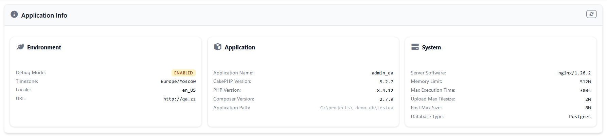

# CakePHP Rhythm Plugin

Real-time application performance monitoring for CakePHP 5.x applications with comprehensive metric collection, storage, and visualization.

## Features

### Core Monitoring
- **Server Performance Monitoring** - CPU, memory, disk usage, and system metrics
- **HTTP Request Tracking** - Response times, status codes, and user request patterns
- **Database Query Performance** - Slow query detection with configurable thresholds
- **Queue System Monitoring** - Job processing, queue statistics, and performance metrics
- **Exception Tracking** - Application exception monitoring and reporting
- **Outgoing Request Monitoring** - External API calls and HTTP client performance
- **Cache Performance** - Cache hit rates and performance metrics
- **Job Performance** - Background job execution times and statistics

### Advanced Features
- **Multi-Server Support** - Monitor multiple servers with unified dashboard
- **Configurable Sampling** - Adjustable sampling rates for different metric types
- **Grouping System** - Automatic grouping of similar metrics to reduce cardinality
- **Real-time Dashboard** - Live performance monitoring with interactive widgets
- **Flexible Storage** - Database and Redis storage options with automatic aggregation
- **Event System** - CakePHP event integration for custom metric recording
- **Command Line Tools** - CLI commands for metric processing and server monitoring

## Installation

1. Install the plugin via Composer:
```bash
composer require skie/rhythm
```

2. Load the plugin in your `Application.php`:
```php
public function bootstrap(): void
{
    parent::bootstrap();

    $this->addPlugin('Rhythm', ['bootstrap' => true, 'routes' => true]);
}
```

3. Run the database migrations:
```bash
bin/cake migrations migrate -p Rhythm
```
4. Database Configuration

> [!NOTE]
> Rhythm's storage implementation currently requires a MySQL, MariaDB, PostgreSQL. It is important to note that `quoteIdentifiers` should be set to true in your database configuration for Rhythm to work properly.

By default, `Rhythm.storage.database.connection` is set to 'default' in the database configuration but you can change it to your own database connection.

## Configuration

The plugin can be configured via the `config/rhythm.php` file:

```php
return [
    'Rhythm' => [
        'enabled' => env('RHYTHM_ENABLED', true),

        'storage' => [
            'driver' => env('RHYTHM_STORAGE_DRIVER', 'database'),
            'database' => [
                'connection' => 'default',
                'tables' => [
                    'entries' => 'rhythm_entries',
                    'aggregates' => 'rhythm_aggregates',
                ],
            ],
            'cache' => [
                'config' => 'default',
                'prefix' => 'rhythm:',
            ],
        ],

        'ingest' => [
            'driver' => env('RHYTHM_INGEST_DRIVER', 'redis'),
            'redis' => [
                'host' => env('REDIS_HOST', '127.0.0.1'),
                'port' => env('REDIS_PORT', 6379),
                'password' => env('REDIS_PASSWORD', null),
                'database' => env('REDIS_DATABASE', 0),
                'queue_key' => 'rhythm:metrics:queue',
                'processing_key' => 'rhythm:metrics:processing',
                'control_channel' => 'rhythm:control',
                'max_items_per_digest' => 100,
                'trim' => [
                    'keep' => '1 hour',
                ],
            ],
        ],

        'recorders' => [
            'servers' => [
                'className' => \Rhythm\Recorder\ServersRecorder::class,
                'enabled' => env('RHYTHM_SERVER_ENABLED', true),
                'server_name' => env('RHYTHM_SERVER_NAME', gethostname()),
                'directories' => explode(':', env('RHYTHM_SERVER_DIRECTORIES', '/')),
                'ignore' => [
                    '/^\/tmp/',
                    '/^\/var\/log/',
                    '/^\/proc/',
                    '/^\/sys/',
                ],
            ],
            'user_requests' => [
                'className' => \Rhythm\Recorder\UserRequestsRecorder::class,
                'enabled' => env('RHYTHM_USER_REQUESTS_ENABLED', true),
                'sample_rate' => env('RHYTHM_USER_REQUESTS_SAMPLE_RATE', 1.0),
                'ignore' => [
                    '#^/rhythm#',
                    '#^/health#',
                ],
            ],
            'slow_queries' => [
                'className' => \Rhythm\Recorder\SlowQueriesRecorder::class,
                'enabled' => env('RHYTHM_SLOW_QUERIES_ENABLED', true),
                'threshold' => env('RHYTHM_SLOW_QUERIES_THRESHOLD', 1000),
                'sample_rate' => env('RHYTHM_SLOW_QUERIES_SAMPLE_RATE', 0.1),
            ],
            'exceptions' => [
                'className' => \Rhythm\Recorder\ExceptionsRecorder::class,
                'enabled' => env('RHYTHM_EXCEPTIONS_ENABLED', true),
                'sample_rate' => env('RHYTHM_EXCEPTIONS_SAMPLE_RATE', 1.0),
            ],
            'queues' => [
                'className' => \Rhythm\Recorder\QueuesRecorder::class,
                'enabled' => env('RHYTHM_QUEUES_ENABLED', true),
                'sample_rate' => env('RHYTHM_QUEUES_SAMPLE_RATE', 1.0),
            ],
            'slow_jobs' => [
                'className' => \Rhythm\Recorder\SlowJobsRecorder::class,
                'enabled' => env('RHYTHM_SLOW_JOBS_ENABLED', true),
                'threshold' => env('RHYTHM_SLOW_JOBS_THRESHOLD', 5000),
                'sample_rate' => env('RHYTHM_SLOW_JOBS_SAMPLE_RATE', 0.1),
            ],
            'slow_requests' => [
                'className' => \Rhythm\Recorder\SlowRequestsRecorder::class,
                'enabled' => env('RHYTHM_SLOW_REQUESTS_ENABLED', true),
                'threshold' => env('RHYTHM_SLOW_REQUESTS_THRESHOLD', 2000),
                'sample_rate' => env('RHYTHM_SLOW_REQUESTS_SAMPLE_RATE', 0.1),
            ],
            'outgoing_requests' => [
                'className' => \Rhythm\Recorder\OutgoingRequestRecorder::class,
                'enabled' => env('RHYTHM_OUTGOING_REQUESTS_ENABLED', true),
                'threshold' => env('RHYTHM_OUTGOING_REQUESTS_THRESHOLD', 1000),
                'sample_rate' => env('RHYTHM_OUTGOING_REQUESTS_SAMPLE_RATE', 0.1),
                'groups' => [
                    '#^https?://api\.([^/]+)\.com/([^/]+)/(\d+)#' => 'https://api.*.com/*/*',
                    '#^https?://([^/]+)\.api\.([^/]+)\.com/([^/]+)#' => 'https://*.api.*.com/*',
                    '#^https?://([^/]+)\.com/api/v(\d+)/([^/]+)#' => 'https://*.com/api/v*/*',
                    '#^https?://([^/]+)\.com/([^/]+)/(\d+)#' => 'https://*.com/*/*',
                ],
            ],
        ],

        'buffer' => env('RHYTHM_BUFFER', 5000),
        'trim' => [
            'keep' => env('RHYTHM_TRIM_KEEP', '24 hours'),
        ],
    ],
];
```

### Environment Variables

Set these environment variables to configure Rhythm:

```bash
# Enable Rhythm
RHYTHM_ENABLED=true

# Storage configuration
RHYTHM_STORAGE_DRIVER=database

# Ingest configuration
RHYTHM_INGEST_DRIVER=redis

# Redis configuration (if using Redis ingest)
REDIS_HOST=127.0.0.1
REDIS_PORT=6379
REDIS_PASSWORD=your_password
REDIS_DATABASE=0

# Recorder configuration
RHYTHM_SERVER_ENABLED=true
RHYTHM_USER_REQUESTS_ENABLED=true
RHYTHM_SLOW_QUERIES_ENABLED=true
RHYTHM_EXCEPTIONS_ENABLED=true
RHYTHM_QUEUES_ENABLED=true
RHYTHM_SLOW_JOBS_ENABLED=true
RHYTHM_SLOW_REQUESTS_ENABLED=true
RHYTHM_OUTGOING_REQUESTS_ENABLED=true
```

## Usage

### Data Flow Architecture

Rhythm uses a two-phase approach for efficient metric collection:

1. **Ingest Phase**: Metrics are collected in memory during requests and stored in a persistent queue
2. **Digest Phase**: Queued metrics are processed into final storage with automatic aggregation

This approach solves PHP's "run and die" problem by persisting metrics between requests.

### Automatic Monitoring

The plugin automatically monitors:
- Server performance metrics (CPU, memory, disk)
- HTTP requests and response times
- Database query performance
- Application exceptions
- Queue system performance
- Background job execution
- Outgoing HTTP requests
- Cache performance

### Manual Metric Recording

You can also record custom metrics:

```php
// In a controller or service
$rhythm = $this->getContainer()->get(\Rhythm\Rhythm::class);

// Record a simple metric
$rhythm->record('custom_metric', 'user_action', 150);

// Set a metric value
$rhythm->set('config_value', 'cache_hit_rate', '85.5');

// Record with aggregations
$rhythm->record('performance', 'api_call', 250)
    ->count()
    ->avg()
    ->max();
```

### Processing Metrics

Metrics are automatically ingested when the buffer is full. To process queued metrics:

#### Redis Ingest (Default)
```bash
# Process metrics from Redis queue
bin/cake rhythm digest
```

#### Null Ingest (Testing/Development)
The Null Ingest driver discards all metrics, useful for:
- Testing environments where you don't want metric overhead
- Temporarily disabling metrics without changing configuration
- Development when you want zero metric collection

```php
// In config/rhythm.php
'ingest' => [
    'driver' => 'null', // Discard all metrics
],
```

No additional commands needed - all metrics are silently discarded.

**Recommended**: Set up a cron job to run digest periodically:
```bash
# Every 5 minutes
*/5 * * * * cd /path/to/your/app && bin/cake rhythm digest
```

### Server Monitoring

Monitor server performance with the check command:

```bash
# Take a single server snapshot
bin/cake rhythm check --once

# Monitor continuously with 5-second intervals
bin/cake rhythm check --interval=5
```

### Dashboard Access

Access the Rhythm dashboard at `/rhythm/dashboard` to view:
 Server state and performance metrics
- Queue activity and statistics
- Slow queries and requests
- Exception tracking
- Cache performance
- Outgoing request monitoring
- Job performance metrics

## Available Recorders

### ServersRecorder
Monitors server performance metrics including CPU, memory, and disk usage.

### UserRequestsRecorder
Tracks HTTP requests, response times, and user request patterns.

### SlowQueriesRecorder
Monitors database query performance and identifies slow queries.

### ExceptionsRecorder
Tracks application exceptions for debugging and monitoring.

### QueuesRecorder
Monitors queue system performance and job processing statistics.

### SlowJobsRecorder
Tracks background job execution times and identifies slow jobs.

### SlowRequestsRecorder
Identifies slow HTTP requests based on configurable thresholds.

### OutgoingRequestRecorder
Monitors external API calls and HTTP client performance with automatic URI grouping.

### GitRecorder
Captures Git repository information including current branch, recent commits, and repository status. Automatically detects Git repositories and provides commit classification and metadata tracking.

## Available Widgets

### ServerStateWidget


Shows real-time server performance with CPU, memory, and disk usage. Displays sparkline charts and status indicators for each server. Shows online/offline status.

### QueuesWidget


Shows job queues with charts showing job states (queued, processing, processed, failed). Shows queue depth, health, and wait times with success rate tracking.

### SlowQueriesWidget


Shows slow database queries with execution times and locations. Shows top 10 slowest queries with sorting options to help find performance issues.

### ExceptionsWidget


Shows application errors and exceptions. Groups by error type and shows frequency counts with sorting by frequency or latest occurrence.

### SlowRequestsWidget


Shows slow HTTP requests with method, path, and response times. Displays top 10 slowest requests with status codes to identify web performance issues.

### SlowOutgoingRequestsWidget
Shows external API calls with grouped URLs and response times. Shows slowest external requests to help optimize API usage.

### SlowJobsWidget
Shows slow background jobs with execution times and status. Shows top 10 slowest jobs with sorting options for job performance monitoring.

### UsageWidget
Displays system resource usage including memory, response times, and request counts. Shows status indicators for each metric.

### AppInfoWidget



Displays comprehensive application information including CakePHP version, PHP version, debug mode status, system configuration, and database information. Provides a quick overview of your application's environment and configuration with detailed system metrics.

### GitWidget


Displays current Git repository information including the active branch, recent commits, and repository status. Helps track deployment status and recent changes with commit classification and metadata.

## Command Line Tools

### rhythm digest
Process queued metrics into final storage.

### rhythm check
Monitor server performance and collect metrics.

### rhythm clear
Clear all stored metrics and aggregates.

### rhythm purge
Purge specific metric types or all data.

## Event System

Rhythm dispatches events for external integrations:

### Available Events
- `Rhythm.metric.recorded` - When a metric is recorded
- `Rhythm.digest.completed` - When metrics are processed to final storage
- `Rhythm.server.beat` - Server performance snapshot events

### Listening to Events

```php
// In a service or component
public function implementedEvents(): array
{
    return [
        'Rhythm.metric.recorded' => 'handleMetricRecorded',
        'Rhythm.digest.completed' => 'handleDigestCompleted',
    ];
}

public function handleMetricRecorded(EventInterface $event): void
{
    $data = $event->getData();
    // Handle metric recording
}

public function handleDigestCompleted(EventInterface $event): void
{
    $data = $event->getData();
    // Handle digest completion
}
```

## Database Schema

The plugin creates these main tables:

### rhythm_entries
Stores raw metric entries with timestamps and values.

### rhythm_aggregates
Stores pre-aggregated metrics for efficient querying and dashboard display.

## API Reference

### Rhythm Class

- `record(string $type, string $key, ?int $value = null, ?int $timestamp = null): RhythmEntry`
- `set(string $type, string $key, string $value, ?int $timestamp = null): RhythmValue`
- `ingest(): int` - Process queued entries
- `aggregate(string $type, array|string $aggregates, int $intervalMinutes): Collection`
- `aggregateTotal(string $type, array|string $aggregates, int $intervalMinutes): float|Collection`
- `graph(string $type, string $aggregate, int $intervalMinutes): Collection`
- `values(string $type, ?array $keys = null): Collection` - Get values for a type
- `report(Throwable $exception): $this` - Report exceptions
- `trim(): void` - Remove old data
- `purge(?array $types = null): void` - Clear data

### Storage Interface

- `store(CollectionInterface $entries): void`
- `aggregate(string $type, array|string $aggregates, int $intervalMinutes): CollectionInterface`
- `trim(): void` - Remove old data
- `purge(?array $types = null): void` - Clear data

## Contributing

1. Fork the repository
2. Create a feature branch
3. Make your changes
4. Add tests
5. Submit a pull request

## License

This plugin is licensed under the MIT License.
