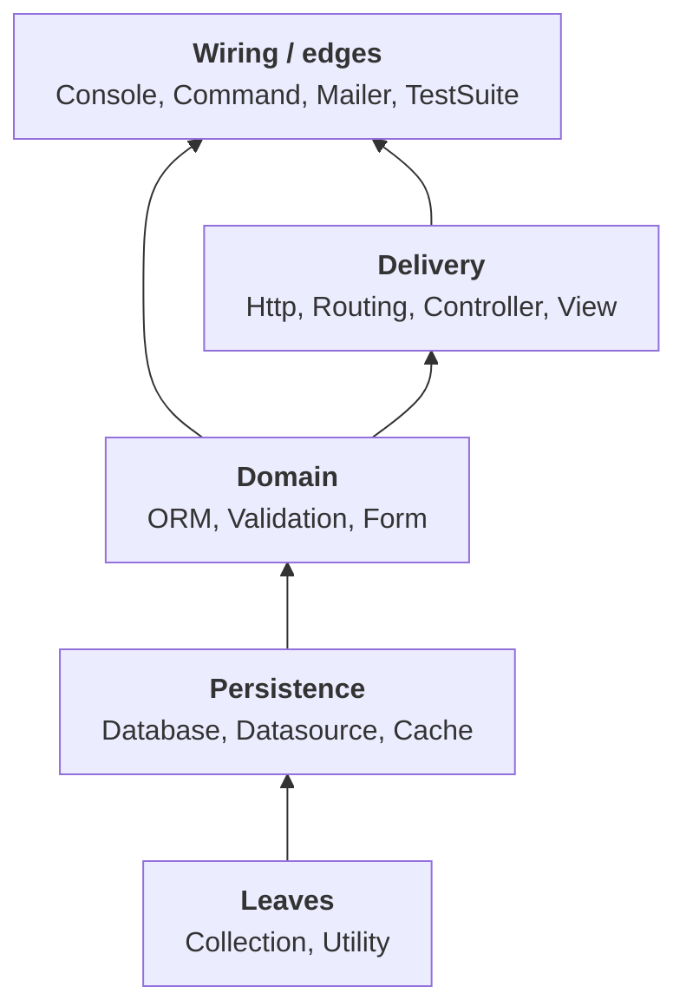

An Architecture Decision Record (ADR) sounds bureaucratic. Wait before you leave.

You join a project and see custom auth middleware, even though the framework has a standard package. A new teammate suggests throwing the custom code away and installing the normal library. That sounds reasonable.

The custom middleware exists because the product needed multi-tenant logic the stock package cannot do. The team knew that. Nobody wrote it down. The teammate spent two days researching before they understood why. A fifteen-line file would have saved those two days.

That file is an ADR. Format is simple: **context** (what is going on), **decision** (what you chose), **consequences** (what follows). It lives in `docs/adr/` next to the code. That is the whole idea.

Michael Nygard described the format in 2011. His point still holds: when a new person sees a strange choice, they have two bad options — accept it blindly or change it blindly. An ADR gives a third: read the context.

This article is about the next step. An ADR records intent. An architecture test refuses silent drift. In PHP, StructArmed (`boundwize/structarmed`) is the guard that turns “we decided these layers” into a red build when a `use` statement disagrees.

## ADR: The Practice Everyone Skips

Teams bookmark DDD talks and Command Query Responsibility Segregation (CQRS) repos. They rarely write down *why this middleware*, *why this package boundary*, *why Controllers may not import Database drivers*. Then someone “cleans up” a decision that was never free.

People who take ADR seriously leave a public trail you can actually open:

- **Kubernetes** — each change goes through an Enhancement Proposal (a KEP). Want to know why Ephemeral Containers exist? Open the KEP: context, alternatives, trade-offs. No guessing.
- **Rust** — language features start as RFCs. Async/await went through many iterations before it landed. The decision history stays visible.
- **Spotify** — they wrote about when to write ADRs. Answer: almost always. ADRs help when ownership moves between teams. The new team reads the history instead of reconstructing it.
- **GOV.UK** — the UK government publishes architecture decisions on GitHub. If ADR felt like a Silicon Valley fashion, here is the public sector doing the same job.

Tools exist (`adr-tools`, Markdown ADR templates such as MADR, log4brains). You do not need a perfect template. Take a decision from last week. Write context, decision, consequences. Commit it. You already keep ADRs.

An ADR will not stop the next hurried pull request. Agreements in a chat thread will not either. If the rule is not in CI, it is optional.

## Architecture Tests: If the Rule Is Not in CI, It Does Not Exist

Familiar story. The team agrees that controllers do not talk to repositories directly — only through services. Someone writes it in the tracker. A month later a release is late. Review misses it. Half a year later half the services break the rule.

The fix is an architecture test: encode the rule, run it in CI, fail the build when someone crosses the line. Not a document you can ignore. A red build you cannot merge.

Other ecosystems already treat this as normal. Java has ArchUnit. PHP has Pest Arch and Arkitect. Go has arch-go. Shopify’s large Ruby monolith uses Packwerk so package boundaries fail the PR. ThoughtWorks calls the wider idea fitness functions: dependency rules are one kind; coverage floors and error budgets are others.

Advice from that world stays good here too. Do not describe the whole architecture on day one. Start with the obvious rule — “domain must not depend on infrastructure” — and add the next rule when the first one is boring.

StructArmed sits in that same family for PHP packages and large CakePHP trees. You declare named layers and a ruleset (who may depend on whom). The analyzer walks imports and type hints. Disallowed edges fail CI. It is not PHPStan and not a style linter. It answers: *does this dependency respect the directed acyclic graph (DAG) we claimed?* — a stack of layers with allowed edges only one way, and no cycles.

MVC and DDD are useful maps. They are also too general for a real product. “Put logic in the model” does not tell you whether billing may import shipping, or whether a shared helper may reach into Http. A complex CakePHP application grows its **own** layers: modules, bounded contexts, delivery code, persistence, wiring. Those layers are the architecture that matters day to day.

The hard part is not naming the folders. It is controlling who may depend on whom. Without that control, a small change in a low-level class pulls half the application with it. Refactors get wider than the ticket. New code copies the shortcut because the shortcut already compiles. Agents copy it even faster.

I wanted a tool that answers one question and refuses to flatter me: *does this `use` statement respect the architecture we said we have?* That is StructArmed. You declare the layers your app actually uses and a ruleset for allowed dependencies. The analyzer fails when code imports across a disallowed edge. It turns “we have our own layers” into a machine-checkable dependency graph.

An ADR can say why you chose those layers. StructArmed says whether yesterday’s commit still honors them.

## Folders Are Not the Architecture

Architecture problems stay invisible while the code still compiles. Folders and namespaces *suggest* a design. **`use` statements are the real design.** Without a check, teams often end up here:

| What you see                               | What actually happened                             |
| ------------------------------------------ | -------------------------------------------------- |
| “Clean” package, painful refactors         | Hidden cycles (A→B and B→A)                        |
| Interfaces in `Contract\` still feel wrong | Ports type-hint types owned by upper layers        |
| One mega-folder “Application”              | One mega-layer → zero internal violations          |
| Green CI, tangled pull requests            | Ruleset weakened so the analyzer stops complaining |

The goal is not a green badge at any cost. The goal is a ruleset that matches how you want the app to depend on itself — and that still fails when someone breaks that rule. Red is useful because it shows a real edge to fix. Do not “fix” by merging cyclic folders into one mega-layer, allowing A and B to depend on each other both ways, or commenting out the whole ruleset so CI looks clean.

StructArmed does not invent your architecture. It locks the dependency rules you chose and forces a choice on every bad edge: move a type, introduce a port, reclassify a class, or leave the violation visible until you fix it.

## What StructArmed Actually Does

Config lives in `structarmed.php` next to the project. You run it locally or in CI:

```shell
composer require --dev boundwize/structarmed
vendor/bin/structarmed analyze src
```

Layers can follow directories or, more usefully in frameworks, fully qualified class name (FQCN) regex (`layerPattern`). Folder is not layer: a class under `Support/` can belong to `Data` if the pattern says so, and first-match order matters when several patterns could apply. The prefix `+Layer` means “this layer and everything it may already use,” so you compress the ruleset without re-listing every shared helper on every line — but you should not use `+` to gift an upper layer the whole stack by accident.

Violations are imports that climb the wrong way through your intended stack, or that create a sideways cycle between siblings that were supposed to stay separate.

## CakePHP Core: Layering You Can Read

CakePHP itself is a large shared codebase. Cache, ORM, Http, View, Console, and many other subsystems live together. The project’s `structarmed.php` maps each major `Cake\` area to a layer, then says who may depend on whom.

```php
return Architecture::define()
    ->layerPattern('Cache', '/^Cake\\\\Cache\\\\.*$/')
    ->layerPattern('Collection', '/^Cake\\\\Collection\\\\.*$/')
    ->layerPattern('Controller', '/^Cake\\\\Controller\\\\.*$/')
    ->layerPattern('Database', '/^Cake\\\\Database\\\\.*$/')
    ->layerPattern('Datasource', '/^Cake\\\\Datasource\\\\.*$/')
    ->layerPattern('Http', '/^Cake\\\\Http\\\\.*$/')
    ->layerPattern('ORM', '/^Cake\\\\ORM\\\\.*$/')
    ->layerPattern('Routing', '/^Cake\\\\Routing\\\\.*$/')
    ->layerPattern('Utility', '/^Cake\\\\Utility\\\\.*$/')
    ->layerPattern('View', '/^Cake\\\\View\\\\.*$/')
    // …other Cake\* subsystems…
    ->ruleset([
        'Collection' => [],
        'Database' => ['+Cache', 'Datasource', 'I18n'],
        'Datasource' => ['Cache', 'Collection', 'Database', '+Event', 'Utility'],
        'ORM' => ['Collection', 'Database', 'Datasource', 'Event', '+Utility', 'Validation'],
        'Controller' => [
            'Datasource', '+Event', 'Form', 'Http', 'Log',
            'ORM', 'Routing', 'Utility', 'View',
        ],
        'View' => ['+Cache', 'Form', '+ORM', '+Routing'],
        'Http' => [
            '+Cache', 'Console', 'Controller', 'Datasource',
            'Error', 'I18n', 'ORM', 'Routing',
        ],
        // …
    ]);
```

Collection is a shared low layer. Database may use Cache and Datasource. ORM sits above Database. Controllers may talk to ORM, Http, and View. View may use ORM. The rules do not invite Database to depend on View. That is correct layering in practice: the folders already existed, and StructArmed makes the dependency story enforceable for every future change.

Notice `+Cache` on Database and `+ORM` on View. The plus expands that layer plus its allowed deps and keeps the file short, while CakePHP still chooses the expansion carefully so Command may use `+Database` and ORM without getting a free pass to View. Your application entrypoints should stay the same way: compress the spine, keep the top narrow enough that future mistakes still fail.

The same file is also a reminder that framework tensions stay named on purpose. Event and Core list each other because the framework accepts that relationship; your billing module should not hide a similar knot inside one mega-layer called “Services.”

A mental picture of the same idea is a **spine**, not a full map of CakePHP. The real `structarmed.php` has about twenty-five named layers and many sideways allows (Http and Controller, Event and Core, Mailer into View). Drawing every edge would be a hairball. The diagram below only shows how the big groups stack:



Read it as “allowed traffic goes up the page.” The PHP ruleset above is the source of truth for who may import whom. Edges that climb the wrong way, or that create a cycle between siblings, are the ones StructArmed should refuse.

## Measure Before You Declare: Graph MCP and Agents

Writing `structarmed.php` from folder names alone usually fails in one of two ways. You create one mega-layer and stay green forever, or you invent a fantasy dependency stack that does not match how the code actually imports. A codebase graph measures the **as-built** picture before you freeze the **as-intended** DAG. The MCP server I use for that is **codebase-memory-mcp** — open source from DeusData, a code-intelligence knowledge graph for AI coding agents ([docs](https://deusdata.github.io/codebase-memory-mcp/), npm package `codebase-memory-mcp`).

It is a local MCP server. It indexes your repository into a persistent graph of classes, imports, calls, and related edges, and your coding agent queries that graph instead of guessing from folders alone. There is no embedded LLM and no API key; indexing stays on your machine. In one sentence: codebase-memory-mcp measures the graph you have, StructArmed freezes the DAG you want, and layer extraction is the translation step between them. An ADR explains why that intended graph is the goal.

### Installing codebase-memory-mcp

```shell
curl -fsSL https://raw.githubusercontent.com/DeusData/codebase-memory-mcp/main/install.sh | bash
```

Restart your editor, then ask the agent to index the project. Prefer real `src` trees and keep mirrors out of the index (for example with `.cbmignore`) so the graph matches the shipped application.

### Multi-step generation: index → extract → draft → verify

Generation is not one prompt that dumps a finished architecture file. It is a sequence, and each step has a different job. The point of the sequence is **not** a green StructArmed run. The point is to find where your application structure already fights itself — cycles, upward imports, vocabulary types sitting too high — and to write a ruleset that keeps those problems visible until someone fixes the code.

You begin by **indexing** clean application source so the agent is not inventing edges from mirrored trees. You **orient** with a package overview that is good for the outer spine — Foundation versus Domain versus Delivery versus Wiring — and you treat that overview as orientation only, because package views love to collapse a fat payments module into one friendly node that looks finished when it is not. When the overview says “one package” and your gut says “this is half the product,” you continue.

You **extract** next. Ask for import relationships scoped inside that fat module, because those counts are what StructArmed will later enforce. Optionally ask for call themes so the agent can explain hubs (“the charge orchestrator wires jobs,” “the catalog façade loads card and invoice indexes”), but do not let calls replace imports when writing layer patterns. Group classes into buckets by folder and by root PHP files that sit beside folders; a `Money` value object and a `BillingBootstrap` class may share a directory and still need different layers. Rank bucket-to-bucket imports: heavy one-way traffic usually means “above,” heavy both-way traffic is a cycle, many-to-one fan-in often means shared vocabulary that belongs low, and one-to-many fan-out often means wiring that belongs high.

This is also where you must brief the agent carefully about **cycles**. A real cycle is valuable information. It means two areas grew into each other and neither can be understood alone. The wrong agent reflex — and the wrong human reflex — is to merge both buckets into one layer, or to allow A→B and B→A in the ruleset, until the analyzer goes quiet. That does not remove the cycle; it only removes the warning. Tell the agent explicitly: list cycles in plain language, do not merge them away, do not add mutual allows, and prefer ports or a later remapping over a green report. StructArmed’s job after extraction is to keep that knot visible until someone introduces a boundary.

Then you **draft**. One `layerPattern` per cluster, specific class patterns before broad `Support\` globs because first match wins, and a ruleset that allows only lower layers in the stack you intend. Do not encode “whatever the graph already does,” because that freezes today’s shortcuts into tomorrow’s policy. Vocabulary types that appear in many interface signatures — money amounts, charge requests, provider payloads — belong in low layers even when their files still live under a transport-looking folder. True ports stay interfaces-only.

Finally you **verify**. Run StructArmed to see what the draft exposes, not to prove the draft is “done.” The first red report is a backlog of structural problems in the app: remap a type into a lower layer, introduce a port, or keep the catch named until you can fix the code. A first `structarmed.php` with only a few broad layers is acceptable if you document that module internals are still unmeasured. A better first file after a graph pass uses finer layers and expects red, because red after a real split means you can finally see the edges that the mega-layer was hiding.

Give the agent that sequence as a fixed job, not a free roam. Success is an honest map of problems you can work through — not a green badge.

## Worked Examples in a Payments Module

The following examples use a fictional `App\Payments` area. The patterns are the same ones you will meet in any large CakePHP domain module.

### One mega-layer, then the truth

Suppose everything under `App\Payments\` starts as a single StructArmed layer. The analyzer is green, and everyone feels safe. In reality, charge features still import “root” catalog types, queue jobs still import the billing orchestrator, and contracts still name provider DTOs that live in an upper layer. When you split into Money, Messages, Contract, Providers, Catalog, Jobs, Process, and Wiring, the violation count jumps. That jump is a feature, not a regression. Green with one mega-layer only means you stopped looking inside the module.

### Interfaces are not free

Contract methods look clean:

```php
namespace App\Payments\Contract;

interface ChargeCalculator
{
    public function total(Money $amount, TaxContext $tax): Money;
}

interface ProviderClient
{
    public function charge(ChargeRequest $request): ChargeResponse;
}
```

People expect two wrong fixes: “interfaces do not count,” or “move `Money` and `ChargeRequest` into the Contract folder.” Signatures are dependencies. The Contract folder stays interfaces only. Types named in those signatures must live in a lower layer that Contract is allowed to use. You do not have to move files; you classify FQCNs:

```php
->layerPattern('Money', [
    '/^App\\\\Payments\\\\(Money|TaxContext)$/',
])
->layerPattern('Messages', [
    '/^App\\\\Payments\\\\Provider\\\\(ChargeRequest|ChargeResponse)$/',
])
```

Files can stay under `Provider/` on disk. The layer map changes. Ruleset: Contract may depend on Money and Messages. Layer is classification of the type, not “put the class file in Contract.” CakePHP’s core config works the same way: `Cake\ORM\` is the ORM layer because of the pattern.

### Cycles need ports, not mutual allows

A `CapturePaymentJob` constructs with a concrete `BillingOrchestrator`. The orchestrator also registers and runs jobs. That is a cycle. The tempting StructArmed “fix” is to allow Jobs → Wiring. Reject that. It hides the cycle and teaches the next change to do the same.

Add narrow ports in Contract. Keep concretes where they are. Jobs type-hint interfaces. The container aliases interface → concrete:

```php
namespace App\Payments\Contract;

interface PaymentCatalog
{
    public function cards(): iterable;
    public function invoices(): iterable;
}

interface BillingControl
{
    public function markCaptured(string $paymentId): void;
    public function fail(string $paymentId, string $reason): void;
}
```

```php
$container->addShared(BillingControl::class, $orchestrator);
$container->add(PaymentCatalog::class, fn () => $container->get(BillingCatalog::class));

$container->add(CapturePaymentJob::class)
    ->addArgument(PaymentCatalog::class)
    ->addArgument(BillingControl::class);
```

The analyzer goes quiet on Jobs ↛ Wiring without merging layers and without mutual allows. Ports go into Contract; concretes stay put.

### Type the domain to a port, not to a process runner

A `MerchantAccount` value object typed to concrete `StripeCliRunner` pulls Process into the wrong place:

```php
// Before
public function __construct(
    public readonly string $merchantId,
    public readonly StripeCliRunner $runner,
) {}

// After
public function __construct(
    public readonly string $merchantId,
    public readonly ProviderProcess $runner,
) {}
```

`StripeCliRunner` implements `ProviderProcess`. Bootstrap still builds `new StripeCliRunner(...)`. Process stays below. One narrow change plus an honest ruleset.

### Facades belong with what they facade

`BillingCatalog` imports `CardIndex` and `InvoiceIndex`. Stripping those imports from the façade would be theatre. Classifying `BillingCatalog` in the same layer as the indexes is the real fix. Putting only the façade in Catalog while `MerchantAccount` stays in a lower “core” layer can create a Core ↔ Catalog cycle through aggregation, so related aggregates often move together. Remapping is not the same as deleting dependencies. Facades live with the things they façade. If a helper under `Support/` implements a Contract interface, it is not a leaf helper anymore — reclassify it instead of allowing Support → Contract “because the path says Support.”

### Named debts you leave red

Some violations should stay red on purpose. A catalog façade that throws a provider-protocol exception tied to HTTP error envelopes is a real smell. A `ChargeRequest` DTO that imports that same protocol exception is a real smell. Allowing Messages → Protocol only to clear the report is not a fix. A red analyzer with two named debts beats a green ruleset that lies.

### Wrong edges next door in CakePHP shape

The same discipline applies beside your payments module. A Database helper that imports View to format an error string is climbing the wrong way. An ORM builder that imports Http request objects should keep mapping in Controller or a dedicated mapper, not unlock ORM → Http in the ruleset. A Utility junk drawer that Controller, ORM, and Mailer all import — while Utility starts importing ORM back — is a cycle; split the drawer instead of merging Utility and ORM into one mega-layer. Mailer may use View and ORM on purpose. A Database driver importing Mailer to “send an alert” is not purpose; it is a shortcut.

### Compress rulesets without hiding mistakes

After layers stabilize, prefer `+` on the spine and keep entrypoints narrow:

```php
'Money' => ['Foundation'],
'Messages' => ['+Money'],
'Contract' => ['+Messages'],
'Catalog' => ['+Contract'],
'Jobs' => ['+Catalog', 'Providers', 'Process'],
'Wiring' => ['+Jobs', 'Providers'],
// Keep top narrow on purpose:
'Command' => ['Wiring', '+Messages', 'Process'],
```

`+Catalog` is fine when the lower ruleset is intentional. `Command => ['+Wiring']` is often too wide, because it would let console commands import every job and provider type forever, and future checks would stop catching that drift.

## What This Combination Actually Solves

**Forgotten why.** ADRs stop blind rewrites of custom multi-tenant auth and similar choices.

**Ignored rules.** Architecture tests — StructArmed here — stop the “we agreed in chat” decay.

**Layer leakage and cycles.** CI fails on the import. You add a port or move the type; you do not widen allows for comfort.

**Agent refactors.** Assistants move namespaces in minutes. Without a guard they recreate the shortest path. With StructArmed they get a concrete failure.

**False green.** One mega-layer, or a ruleset that allows every edge the code already has. Both lie. Split, port, remap — or leave CATCH visible.

**Onboarding.** Read the ADR for *why*. Read `structarmed.php` for *what is allowed*. Let CI enforce both while people and agents work.

## Anti-Patterns and Adoption

**Mega-layer.** One layer for a whole subsystem so internals never fail. Useful as a temporary first pass. Fatal as a permanent policy.

**Mutual allows.** A may use B and B may use A “because they call each other.” That is how you hide a cycle.

**Concretes in Contract.** Moving classes into the interface folder so signatures “fit.” Keep Contract thin. Move vocabulary types down with patterns.

**Widening leaves.** Allowing shared DTOs to import protocol or delivery types only to silence Messages noise.

**Interface free pass.** Believing type hints on interfaces do not create dependencies.

**Mute everything.** Unregistering every noisy hub. Deliberate DX facades can be policy. A blanket mute is not.

**ADR without a test.** A beautiful `docs/adr/` tree and no CI check. The next release will still invent edges.

If a change makes the analyzer green without making the dependency honest, it is not a fix.

You can begin with only a few broad layers and document that module internals are still unmeasured — or run the graph first, draft finer layers for the fattest module, expect red, and burn down. Prefer ports and remaps over ruleset widening. Keep Command and application wiring narrower than “plus everything.” Document remaining catches by theme, fix the code later, and re-run after every real change so counts fall for the right reasons. Baselines help mature trees lock the boundaries you care about today without pretending the past is clean.

A brief you can give an agent:

```text
Index src only. Ignore vendor, generated trees, and mirrors.
1) Package overview for orientation only — do not stop if a fat module collapses to one node.
2) Import edges inside App\Payments (or the module under review).
3) Propose layers from buckets and import ranks.
4) List cycles in plain language. Do not merge them. Do not add mutual allows.
5) Draft structarmed.php for intended top-down order, not for every existing shortcut.
6) Run analyzer. Triage: remap, port, or keep CATCH visible.
Do not widen allows only to go green.
If the layer choice is non-obvious, draft a short ADR (context / decision / consequences).
```

## Closing Thoughts

Books teach patterns. Production cases teach when the pattern did not fit. ADRs teach why *your* team chose this shape. Architecture tests teach the codebase to remember that choice after the author leaves the chat.

Large application architecture fails when the folders look layered and the imports are not. StructArmed will not design the app for you. It will sit next to review and tests as an architecture buddy that does not get tired of reading `use` statements.

CakePHP core shows how a real framework publishes subsystem boundaries. **codebase-memory-mcp** helps you and your agents see coupling before you write that config. StructArmed then keeps the config honest as the application grows.

If you are new to the tool, you can begin with only a few broad layers (for example Foundation, Domain, Delivery, Wiring) and note that the insides are not checked yet. When that setup stays green but changes still feel risky, split the fat areas into finer layers — expect more violations at first, because you are finally measuring real imports. Then pay those edges down with ports, leaf types, and remaps, or leave a named catch until you can.

Your layers do not need more confidence. They need a recorded decision and a ruleset that refuses to lie.
