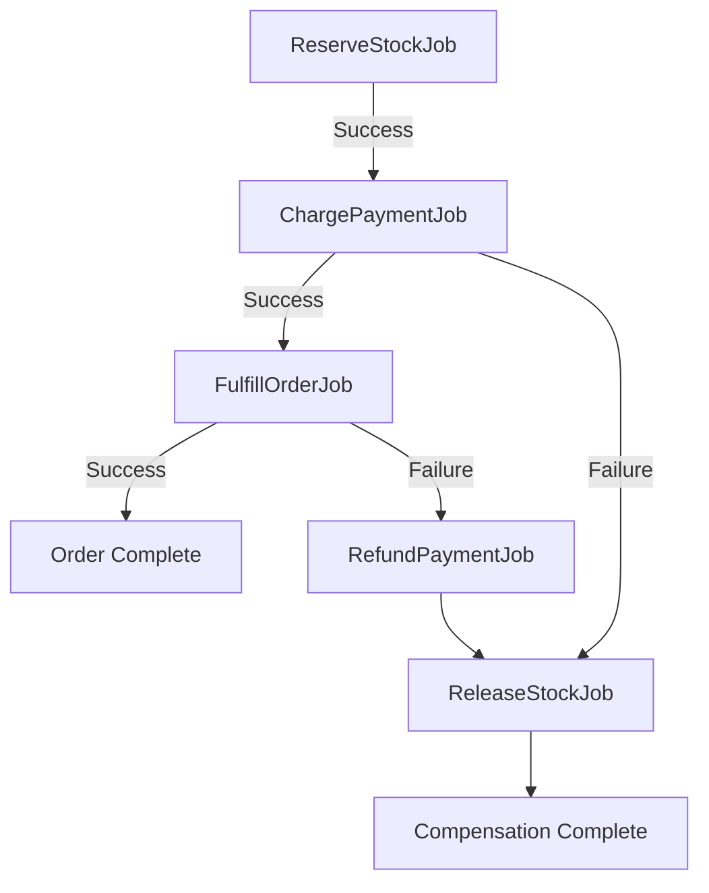
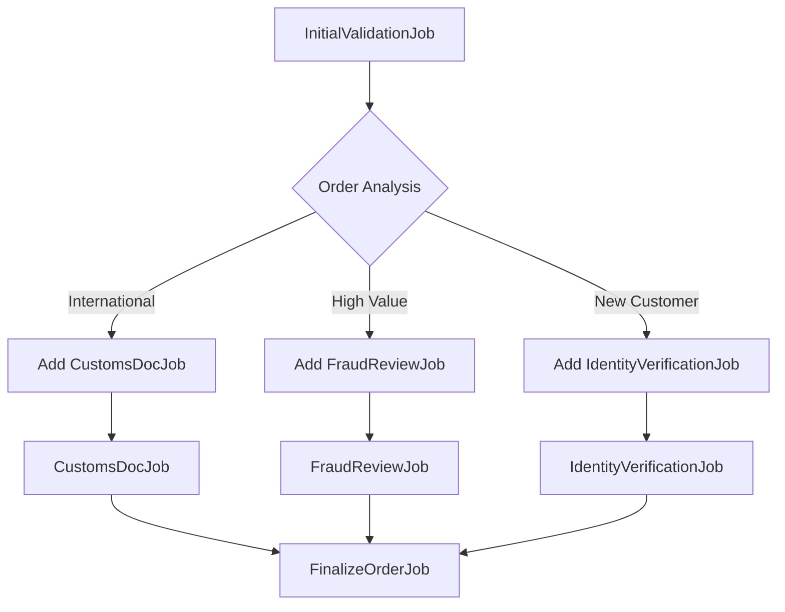

# When Jobs Need to Work Together

Most queue systems are great at running independent jobs. You push a job, a worker picks it up, it runs, it's done. This works perfectly until you need jobs that depend on each other. Until you need to process a thousand items in parallel and track when they're all done. Until you need to roll back three completed operations because the fourth one failed.

That's when you realize your queue system isn't enough. You need something that understands relationships between jobs. Something that knows how to coordinate parallel execution. Something that can handle failures gracefully with proper compensation.

The [`crustum/batch-queue`](https://github.com/crustum/batch-queue) plugin for CakePHP brings this coordination layer to your queue system. It sits on top of CakePHP Queue and adds the intelligence needed for complex job workflows.

## Two Patterns That Cover Everything

Job coordination falls into two fundamental patterns, and understanding them helps you design better workflows.

The first pattern is parallel execution. You have one operation that needs to happen for many items. Process a thousand orders. Send emails to ten thousand users. Generate reports for every department. The job is the same, only the data changes. You want all of them running at once, taking advantage of every worker you have. When they're all done, you want to know.

The second pattern is sequential chains. You have multiple operations that must happen in order. Validate an order, charge the payment, send a confirmation. Each step depends on the previous one completing successfully. Each step might need data from earlier steps. If anything fails, you need to undo what already happened.

These two patterns handle the vast majority of workflow scenarios you'll encounter. Sometimes you'll combine them, running parallel batches within chain steps or chaining operations after parallel completion. But the fundamentals remain these two patterns.

## Parallel Batches: The Map-Reduce Pattern

Let's start with parallel batches because they're the simpler of the two. You have one job class, and you run it with different arguments for each item you're processing.

In a controller, you get BatchManager through dependency injection:

```php
use Crustum\BatchQueue\Service\BatchManager;

public function processOrders(BatchManager $batchManager)
{
    $batchId = $batchManager->batch([
            ['class' => ProcessOrderJob::class, 'args' => ['order_id' => 1]],
            ['class' => ProcessOrderJob::class, 'args' => ['order_id' => 2]],
            ['class' => ProcessOrderJob::class, 'args' => ['order_id' => 3]],
            ['class' => ProcessOrderJob::class, 'args' => ['order_id' => 4]],
        ])
        ->dispatch();
}
```

All four jobs start executing immediately. Each gets its own `order_id` argument. The batch tracks them all together. When the last job completes, the batch is done.

The job itself is straightforward. It receives its specific arguments through the message, does its work, and acknowledges completion.

```php
use Cake\Queue\Job\JobInterface;
use Cake\Queue\Job\Message;
use Interop\Queue\Processor;

class ProcessOrderJob implements JobInterface
{
    public function execute(Message $message): ?string
    {
        $orderId = $message->getArgument('order_id');

        $order = $this->Orders->get($orderId);
        $this->processOrder($order);

        return Processor::ACK;
    }
}
```

This pattern scales beautifully. Processing one hundred orders or ten thousand orders uses the same code. The only difference is how many workers you run. More workers means more parallelism, faster completion.

To complete the map-reduce pattern, jobs can return results that get aggregated in a completion callback. First, make your job return results:

```php
use Crustum\BatchQueue\ResultAwareInterface;

class ProcessOrderJob implements JobInterface, ResultAwareInterface
{
    private mixed $result = null;

    public function execute(Message $message): ?string
    {
        $orderId = $message->getArgument('order_id');

        $order = $this->Orders->get($orderId);
        $total = $this->processOrder($order);

        $this->result = [
            'order_id' => $orderId,
            'total' => $total,
            'processed_at' => time(),
        ];

        return Processor::ACK;
    }

    public function getResult(): mixed
    {
        return $this->result;
    }
}
```

The result is automatically stored when the job completes. Now add a completion callback to aggregate all results:

```php
use Crustum\BatchQueue\Storage\BatchStorageInterface;

class BatchCompletionJob implements JobInterface
{
    private BatchStorageInterface $storage;

    public function __construct(BatchStorageInterface $storage)
    {
        $this->storage = $storage;
    }

    public function execute(Message $message): ?string
    {
        $batchId = $message->getArgument('batch_id');
        $results = $this->storage->getBatchResults($batchId);

        $totalRevenue = 0;
        $processedCount = 0;

        foreach ($results as $result) {
            if (is_array($result) && isset($result['total'])) {
                $totalRevenue += $result['total'];
                $processedCount++;
            }
        }

        $this->sendSummaryEmail($totalRevenue, $processedCount);
        $this->updateDashboard($totalRevenue, $processedCount);

        return Processor::ACK;
    }
}
```

Register `BatchCompletionJob` in your `Application::services()` method:

```php
use App\Job\BatchCompletionJob;
use Crustum\BatchQueue\Storage\BatchStorageInterface;

public function services(ContainerInterface $container): void
{
    $container->add(BatchCompletionJob::class)
        ->addArgument(BatchStorageInterface::class);
}
```

Now wire it all together with the completion callback:

```php
$batchId = $batchManager->batch([
    ['class' => ProcessOrderJob::class, 'args' => ['order_id' => 1]],
    ['class' => ProcessOrderJob::class, 'args' => ['order_id' => 2]],
    ['class' => ProcessOrderJob::class, 'args' => ['order_id' => 3]],
    ['class' => ProcessOrderJob::class, 'args' => ['order_id' => 4]],
])
->onComplete([
    'class' => BatchCompletionJob::class,
])
->dispatch();
```

This completes the map-reduce pattern. The map phase processes each order in parallel, returning individual results. The reduce phase aggregates those results in the completion callback, calculating totals, sending summaries, or updating dashboards.

Parallel batches shine when you have independent operations that don't need to know about each other. Process orders. Send emails. Generate reports. Resize images. Any map-reduce style operation fits this pattern perfectly.

## Sequential Chains: Building Context Step by Step

Sequential chains are where things get interesting. Jobs execute one after another, and each job can pass data to the next. This context accumulation is what makes chains powerful.

```php
use Crustum\BatchQueue\Service\BatchManager;

public function checkoutOrder(BatchManager $batchManager)
{
    $batchId = $batchManager->chain([
        ValidateOrderJob::class,
        ChargePaymentJob::class,
        SendConfirmationJob::class,
    ])
    ->setContext(['order_id' => 123])
    ->dispatch();
}
```

The chain executes in strict order. `ValidateOrderJob` runs first with the initial context containing just the order ID. When it completes, `ChargePaymentJob` runs next. When payment completes, `SendConfirmationJob` runs last.

What makes this powerful is context accumulation. Each job can add data to the context, and subsequent jobs automatically receive that data.

```php
use Crustum\BatchQueue\ContextAwareInterface;

class ValidateOrderJob implements JobInterface, ContextAwareInterface
{
    private array $context = [];

    public function setContext(array $context): void
    {
        $this->context = $context;
    }

    public function getContext(): array
    {
        return $this->context;
    }

    public function execute(Message $message): ?string
    {
        $orderId = $this->context['order_id'];

        $order = $this->Orders->get($orderId);
        $this->validateOrder($order);

        $this->context['validated'] = true;
        $this->context['total'] = $order->total;
        $this->context['items'] = $order->items;

        return Processor::ACK;
    }
}
```

The validation job adds three pieces of information to the context. The next job in the chain automatically receives them.

```php
class ChargePaymentJob implements JobInterface, ContextAwareInterface
{
    private array $context = [];

    public function setContext(array $context): void
    {
        $this->context = $context;
    }

    public function getContext(): array
    {
        return $this->context;
    }

    public function execute(Message $message): ?string
    {
        $total = $this->context['total'];
        $orderId = $this->context['order_id'];

        $transactionId = $this->chargePayment($orderId, $total);

        $this->context['transaction_id'] = $transactionId;
        $this->context['charged_at'] = time();

        return Processor::ACK;
    }
}
```

The payment job uses the total from the validation step and adds transaction details to the context. The confirmation job receives everything from both previous jobs.

This context accumulation enables complex workflows where each step builds on previous results. You're not just chaining independent operations, you're building a coherent process where data flows naturally from step to step.

## Saga Compensation: When Things Go Wrong

Here's where BatchQueue really shines. In distributed systems, you can't use database transactions across multiple operations. You need saga patterns with compensation. When something fails, you need to undo what already happened.

Let's build a realistic checkout process. We're selling physical products, so we need to reserve stock before charging payment. If payment fails, we must release the reserved stock. If stock reservation fails after payment, we must refund the payment.

```php
use Crustum\BatchQueue\Service\BatchManager;

public function checkout(BatchManager $batchManager)
{
    $batchId = $batchManager->chain([
        [ReserveStockJob::class, ReleaseStockJob::class],
        [ChargePaymentJob::class, RefundPaymentJob::class],
        [FulfillOrderJob::class, CancelFulfillmentJob::class],
    ])
    ->setContext(['order_id' => 123])
    ->dispatch();
}
```

Each step in the chain has two jobs: the main operation and its compensation. The compensation job only runs if something fails later in the chain.

Let's implement the stock reservation and its compensation.

```php
class ReserveStockJob implements JobInterface, ContextAwareInterface
{
    private array $context = [];

    public function setContext(array $context): void
    {
        $this->context = $context;
    }

    public function getContext(): array
    {
        return $this->context;
    }

    public function execute(Message $message): ?string
    {
        $orderId = $this->context['order_id'];

        $order = $this->Orders->get($orderId, ['contain' => ['OrderItems.Products']]);

        $reservationId = $this->StockReservations->create([
            'order_id' => $orderId,
            'expires_at' => new DateTime('+30 minutes'),
        ]);

        foreach ($order->order_items as $item) {
            $available = $this->Stock->getAvailable($item->product_id);

            if ($available < $item->quantity) {
                throw new InsufficientStockException(
                    "Product {$item->product_id} has insufficient stock"
                );
            }

            $this->Stock->reserve($item->product_id, $item->quantity, $reservationId);
        }

        $this->context['reservation_id'] = $reservationId;
        $this->context['reserved_at'] = time();

        return Processor::ACK;
    }
}
```

The compensation job releases the reserved stock if payment fails.

```php
class ReleaseStockJob implements JobInterface
{
    public function execute(Message $message): ?string
    {
        $compensation = $message->getArgument('_compensation');
        $context = $compensation['context'];

        $reservationId = $context['reservation_id'];

        $this->Stock->releaseReservation($reservationId);
        $this->StockReservations->delete($reservationId);

        return Processor::ACK;
    }
}
```

Now the payment job and its compensation.

```php
class ChargePaymentJob implements JobInterface, ContextAwareInterface
{
    private array $context = [];

    public function setContext(array $context): void
    {
        $this->context = $context;
    }

    public function getContext(): array
    {
        return $this->context;
    }

    public function execute(Message $message): ?string
    {
        $orderId = $this->context['order_id'];
        $order = $this->Orders->get($orderId);

        try {
            $result = $this->PaymentGateway->charge([
                'amount' => $order->total,
                'currency' => 'USD',
                'customer_id' => $order->customer_id,
            ]);

            $this->context['transaction_id'] = $result['transaction_id'];
            $this->context['charged_at'] = time();

            return Processor::ACK;

        } catch (PaymentFailedException $e) {
            throw $e;
        }
    }
}

class RefundPaymentJob implements JobInterface
{
    public function execute(Message $message): ?string
    {
        $compensation = $message->getArgument('_compensation');
        $context = $compensation['context'];

        $transactionId = $context['transaction_id'];

        $this->PaymentGateway->refund($transactionId);

        return Processor::ACK;
    }
}
```

Here's what happens in different failure scenarios. If stock reservation fails, nothing rolls back because nothing succeeded yet. If payment fails, the stock reservation compensation runs automatically, releasing the reserved stock. If fulfillment fails, both payment and stock compensations run in reverse order, refunding the payment then releasing the stock.



The beauty of this pattern is that you define compensations once, and the system handles everything. You don't write if-statements checking what succeeded and what failed. You don't manually track state. The saga pattern handles it all automatically.

This is crucial for e-commerce, financial systems, and any workflow where you can't use database transactions. You get distributed transaction semantics through compensation instead of locking.

## Conditional Flows: Adapting at Runtime

Sometimes you don't know the full workflow upfront. You need to make decisions based on data that only becomes available during execution. BatchQueue handles this through dynamic job addition.

Let's build a compliance check system. When a customer places an order, we need to validate it. But the validation requirements depend on factors we discover during validation. International orders need customs documentation. Large orders need fraud review. First-time customers need identity verification.

We start with a simple chain that has just the initial validation step.

```php
use Crustum\BatchQueue\Service\BatchManager;

public function validateOrder(BatchManager $batchManager)
{
    $batchId = $batchManager->chain([
        InitialValidationJob::class,
    ])
    ->setContext(['order_id' => 123])
    ->dispatch();
}
```

The initial validation job examines the order and decides what additional checks are needed. It dynamically adds those checks to the batch, and then adds the finalization job at the end to ensure it runs after all conditional checks complete.

```php
use Crustum\BatchQueue\Service\BatchManager;

class InitialValidationJob implements JobInterface, ContextAwareInterface
{
    private array $context = [];
    private BatchManager $batchManager;

    public function __construct(BatchManager $batchManager)
    {
        $this->batchManager = $batchManager;
    }

    public function setContext(array $context): void
    {
        $this->context = $context;
    }

    public function getContext(): array
    {
        return $this->context;
    }

    public function execute(Message $message): ?string
    {
        $orderId = $this->context['order_id'];
        $batchId = $message->getArgument('batch_id');

        $order = $this->Orders->get($orderId, [
            'contain' => ['Customer', 'ShippingAddress']
        ]);

        $additionalJobs = [];

        if ($order->shipping_address->country !== 'US') {
            $additionalJobs[] = CustomsDocumentationJob::class;
            $this->context['requires_customs'] = true;
        }

        if ($order->total > 5000) {
            $additionalJobs[] = FraudReviewJob::class;
            $this->context['requires_fraud_review'] = true;
        }

        if ($order->customer->order_count === 0) {
            $additionalJobs[] = IdentityVerificationJob::class;
            $this->context['requires_identity_verification'] = true;
        }

        if (!empty($additionalJobs)) {
            $this->batchManager->addJobs($batchId, $additionalJobs);
            $this->context['additional_checks_added'] = count($additionalJobs);
        }

        $this->batchManager->addJobs($batchId, [FinalizeOrderJob::class]);

        $this->context['initial_validation_complete'] = true;

        return Processor::ACK;
    }
}
```

The dynamically added jobs receive the accumulated context and can add their own data.

```php
class CustomsDocumentationJob implements JobInterface, ContextAwareInterface
{
    private array $context = [];

    public function setContext(array $context): void
    {
        $this->context = $context;
    }

    public function getContext(): array
    {
        return $this->context;
    }

    public function execute(Message $message): ?string
    {
        $orderId = $this->context['order_id'];
        $order = $this->Orders->get($orderId, ['contain' => ['OrderItems.Products']]);

        $hsCode = $this->classifyProducts($order->order_items);
        $dutyAmount = $this->calculateDuty($order, $hsCode);

        $documentId = $this->CustomsDocuments->generate([
            'order_id' => $orderId,
            'hs_code' => $hsCode,
            'duty_amount' => $dutyAmount,
        ]);

        $this->context['customs_document_id'] = $documentId;
        $this->context['duty_amount'] = $dutyAmount;

        return Processor::ACK;
    }
}

class FraudReviewJob implements JobInterface, ContextAwareInterface
{
    private array $context = [];

    public function setContext(array $context): void
    {
        $this->context = $context;
    }

    public function getContext(): array
    {
        return $this->context;
    }

    public function execute(Message $message): ?string
    {
        $orderId = $this->context['order_id'];

        $riskScore = $this->FraudDetection->analyze($orderId);

        if ($riskScore > 0.8) {
            $this->context['requires_manual_review'] = true;
            $this->context['fraud_risk_score'] = $riskScore;

            $this->Notifications->alertFraudTeam($orderId, $riskScore);
        } else {
            $this->context['fraud_check_passed'] = true;
        }

        return Processor::ACK;
    }
}
```

The finalization job is added dynamically after all conditional checks, ensuring it always runs last. It receives context from all previous jobs, whether they were in the original chain or added dynamically.

```php
class FinalizeOrderJob implements JobInterface, ContextAwareInterface
{
    private array $context = [];

    public function setContext(array $context): void
    {
        $this->context = $context;
    }

    public function getContext(): array
    {
        return $this->context;
    }

    public function execute(Message $message): ?string
    {
        $orderId = $this->context['order_id'];

        if (isset($this->context['requires_manual_review']) &&
            $this->context['requires_manual_review']) {
            $this->Orders->markPendingReview($orderId);
            return Processor::ACK;
        }

        $updateData = ['status' => 'validated'];

        if (isset($this->context['customs_document_id'])) {
            $updateData['customs_document_id'] = $this->context['customs_document_id'];
            $updateData['duty_amount'] = $this->context['duty_amount'];
        }

        $this->Orders->update($orderId, $updateData);

        return Processor::ACK;
    }
}
```

The flow adapts based on runtime data. A domestic order from a returning customer runs just the initial validation and finalization. An international order from a new customer with a large total runs the initial validation, then customs documentation, fraud review, identity verification, and finally the finalization job. The finalization job is always added dynamically at the end, ensuring it runs after all conditional checks complete. Same code, different execution paths.



You can even chain dynamic additions. A dynamically added job can itself add more jobs. This enables multi-level decision trees where each level reveals information that determines the next level.

## Bringing It Together

What makes BatchQueue powerful is how these patterns compose. You can run parallel batches within sequential chains. You can add compensation to both patterns. You can dynamically add jobs to either pattern. You can track progress across everything.

The plugin handles the complexity of coordination. Job position tracking. Context accumulation and passing. Compensation triggering on failures. Progress calculation. Completion detection. You just describe the workflow, and the system executes it.

Start simple. Use parallel batches for map-reduce operations. Use sequential chains when order matters. Add compensation when you need rollback capability. Add dynamic job addition when you need conditional flows.

The infrastructure scales with your needs. Run more workers for higher throughput. Use named queues to isolate workloads. Switch to Redis storage for massive batch volumes. The patterns stay the same while the infrastructure adapts.

Whether you're processing customer orders, generating reports, managing deployments, or orchestrating microservices, these two patterns cover most scenarios. Parallel execution for independent operations. Sequential chains for dependent workflows. Compensation for failure handling. Dynamic addition for conditional logic.

That's the power of proper job coordination. You're not fighting your queue system anymore. You're describing workflows at the right level of abstraction, and the system makes them happen.


