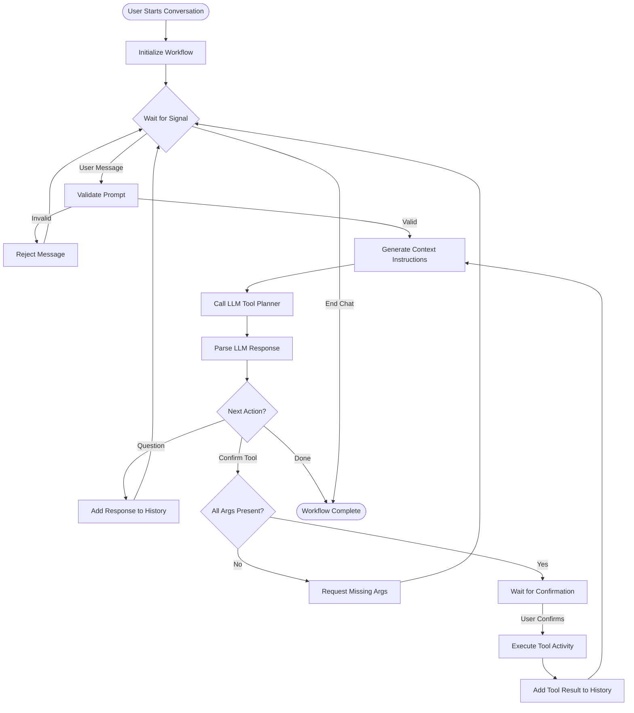

# Temporal: Building AI Agents with Durable Conversations

Traditional AI agent implementations face a fundamental challenge: how do you maintain conversational state across long-running interactions? What happens when a user's conversation spans multiple sessions, requires tool confirmations, or needs to pause while waiting for external data? How do you ensure that complex multi-step agent workflows complete reliably, even when workers restart or network calls fail?

That's where Temporal comes in. Temporal's durable execution model provides the perfect foundation for building AI agents that can maintain state across conversations, orchestrate tool execution with automatic retries, and pause indefinitely while waiting for user input or external signals.

This article explores how to build production-ready AI agents using the Temporal plugin combined with the AIAgent framework. We'll implement a real-world agent goal: an ecommerce order status checker, demonstrating how workflows orchestrate LLM interactions, manage tool execution, and coordinate multi-step conversations that can span hours or days.

## Understanding AI Agent Architecture with Temporal

Before diving into implementation, let's understand how Temporal's execution model maps to AI agent requirements: workflows orchestrate conversations, activities handle LLM interactions and tool execution, and signals enable real-time user interaction.

### Workflows: Durable Conversation Orchestration

A workflow in the AI agent system orchestrates the entire conversation lifecycle. The workflow maintains conversation history, manages tool execution state, and coordinates between the LLM and your application's tools. Workflows are deterministic and durable—if a worker crashes mid-conversation, Temporal automatically resumes from the last checkpoint, preserving all conversation context.

The workflow doesn't directly call LLMs or execute tools. Instead, it delegates to activities, which can perform I/O operations like API calls and database queries. This separation ensures the workflow remains deterministic while activities handle the non-deterministic work.

### Activities: LLM Interactions and Tool Execution

Activities perform the actual work: calling LLM APIs to generate responses, executing tools (database queries, API calls, file operations), and validating user input. Activities can fail and be automatically retried according to your retry policy. This is crucial for LLM interactions, which can fail due to rate limits, network issues, or API errors.

The key distinction: workflows orchestrate the conversation flow, while activities perform the actual LLM calls and tool executions.

### Signals: Real-Time User Interaction

Signals allow users to interact with running workflows in real-time. When a user sends a message, the controller sends a signal to the workflow. The workflow processes the signal, updates its state, and continues execution. Signals enable the interactive, conversational nature of AI agents while maintaining durability guarantees.

### Tools: Extensible Agent Capabilities

Tools are the agent's interface to your application. Each tool has a definition (name, description, arguments) and a handler function that executes the actual work. Tools can query databases, call APIs, perform calculations, or trigger any business logic. The workflow orchestrates tool execution, ensuring proper sequencing and confirmation before execution.

## The Order Status Goal: Ecommerce Customer Support

Our first agent goal demonstrates a common customer support scenario: helping customers check their order status and track packages. Here's the complete flow:

1. Customer asks about order status
2. Agent requests order number
3. Agent calls `GetOrder` tool to fetch order details
4. Agent presents order status to customer
5. If order is shipped, agent offers to track package
6. If customer accepts, agent calls `TrackPackage` tool
7. Agent presents tracking information
8. Conversation completes

This workflow can pause at any step while waiting for user input. Traditional stateless API approaches would require maintaining conversation state in a database and polling for updates. Temporal handles this automatically—the workflow pauses, waits for signals, and resumes seamlessly.

## Plugin Architecture: Goals, Tools, and Registries

The AIAgent plugin uses a registry pattern that feels natural in CakePHP applications. Goals define what the agent can accomplish, tools define what actions the agent can take, and registries manage discovery and execution.

### Defining Goals

Goals encapsulate an agent's purpose, available tools, and conversation examples. Here's the Order Status goal:

```php
// src/Goal/Ecommerce/OrderStatusGoal.php
class OrderStatusGoal
{
    public static function get(): AgentGoal
    {
        $starterPrompt = "Welcome me, give me a description of what you can do, then ask me for the details you need to do your job.";

        $exampleHistory = implode("\n ", [
            "user: I'd like to know the status of my order",
            "agent: Sure! I can help you out with that. May I have your order number?",
            "user: 102 ",
            "user_confirmed_tool_run: <user clicks confirm on GetOrderStatus tool>",
            "tool_result: { 'id': '102', 'summary': 'Red Sunglasses', 'status': 'shipped', ... }",
            "agent: Your order 'Red Sunglasses,' placed April 1, 2025, was shipped on April 6, 2025. Would you like to see the tracking information?",
            "user: Yes",
            "user_confirmed_tool_run: <user clicks confirm on TrackPackage tool>",
            "tool_result: { 'scheduled_delivery_date': 'April 30, 2025', 'carrier': 'USPS', ... }",
            "agent: Your package is scheduled to be delivered on April 30, 2025 via USPS...",
        ]);

        return new AgentGoal(
            id: 'goal_ecomm_order_status',
            categoryTag: 'ecommerce',
            agentName: 'Check Order Status',
            agentFriendlyDescription: 'Check the status of your order.',
            tools: [
                GetOrderTool::getDefinition(),
                TrackPackageTool::getDefinition(),
            ],
            description: 'The user wants to learn the status of a specific order. If the status is \'shipped\' or \'delivered\', they might want to get the package tracking information. To assist with that goal, help the user gather args for these tools in order: ' .
                '1. GetOrder: get information about an order' .
                '2. TrackPackage: provide tracking information for the package. This tool is optional and should only be offered if the status is \'shipped\' OR \'delivered\' - otherwise, skip this tool and do not mention it to the user.',
            starterPrompt: $starterPrompt,
            exampleConversationHistory: $exampleHistory,
        );
    }
}
```

The goal defines the agent's identity, available tools, step-by-step instructions for the LLM, and example conversations that guide the agent's behavior. The example conversation is crucial—it teaches the LLM how to interact with users and when to call tools.

### Defining Tools

Tools are self-contained units that define their interface and execution logic. Here's the GetOrder tool:

```php
// src/Tool/Ecommerce/GetOrderTool.php
class GetOrderTool
{
    public static function getDefinition(): ToolDefinition
    {
        return new ToolDefinition(
            name: 'GetOrder',
            description: 'Get information about an order by order ID.',
            arguments: [
                new ToolArgument(
                    name: 'order_id',
                    type: 'string',
                    description: 'ID of order to determine status of'
                ),
            ],
            handler: function(array $args): array {
                $orderId = $args['order_id'] ?? null;

                if (!$orderId) {
                    return ['error' => 'Order ID is required'];
                }

                $dataPath = ROOT . DS . 'data' . DS . 'customer_order_data.json';
                $data = json_decode(file_get_contents($dataPath), true);
                $orders = $data['orders'] ?? [];

                foreach ($orders as $order) {
                    if ($order['id'] === $orderId) {
                        return $order;
                    }
                }

                return ['error' => "Order {$orderId} not found."];
            },
        );
    }
}
```

The tool definition includes a name, description, argument schema, and handler closure. The handler can perform any operation: database queries, API calls, file operations, or business logic. Tools are registered in the application bootstrap and discovered automatically by the workflow.

## Workflow Implementation: Orchestrating Conversations

The workflow is the heart of the AI agent system. It orchestrates LLM interactions, manages conversation history, coordinates tool execution, and waits for user signals. Let's examine the core execution loop:

```php
public function execute(array $data): \Generator
{
    $goalId = $data['goal_id'] ?? null;
    $goalRegistry = GoalRegistry::getInstance();
    $this->goal = $goalRegistry->get($goalId);

    $this->conversationHistory = new ConversationHistory();

    $waitingForConfirm = false;
    $currentTool = null;

    while (true) {
        $awaitCondition = fn() => !empty($this->promptQueue) || $this->chatEnded || $this->confirmed;
        yield Workflow::await($awaitCondition);

        if ($this->chatShouldEnd()) {
            return json_encode($this->conversationHistory->toArray());
        }

        $readyForTool = $this->readyForToolExecution($waitingForConfirm, $currentTool);

        if ($readyForTool) {
            $waitingForConfirm = yield from $this->executeTool($currentTool);
            continue;
        }

        if (!empty($this->promptQueue)) {
            $prompt = array_shift($this->promptQueue);

            if ($this->isUserPrompt($prompt)) {
                $this->conversationHistory->addMessage('user', $prompt);

                $validationResult = yield $this->toolActivities->agentValidatePrompt([
                    'prompt' => $prompt,
                    'conversation_history' => $this->conversationHistory->toArray(),
                    'agent_goal' => $this->goal->id,
                ]);

                if (!$validationResult['validationResult']) {
                    $this->conversationHistory->addMessage('agent', $validationResult['validationFailedReason']);
                    continue;
                }
            }

            $promptGenerator = new AgentPromptGenerator();
            $contextInstructions = $promptGenerator->generate(
                $this->goal,
                $this->conversationHistory,
                $this->multiGoalMode,
                $this->toolData ? json_encode($this->toolData) : null
            );

            $toolDataArray = yield $this->toolActivities->agentToolPlanner([
                'prompt' => $prompt,
                'context_instructions' => $contextInstructions,
            ]);

            $this->toolData = new ToolData(
                next: $toolDataArray['next'] ?? 'question',
                tool: $toolDataArray['tool'] ?? null,
                args: $toolDataArray['args'] ?? [],
                response: $toolDataArray['response'] ?? '',
                forceConfirm: $toolDataArray['force_confirm'] ?? true
            );

            $nextStep = $this->toolData->next;
            $currentTool = $this->toolData->tool;

            $this->conversationHistory->addMessage('agent', $this->toolData->toArray());

            if (($nextStep === 'confirm' || $nextStep === 'question') && $currentTool !== null) {
                $args = $this->toolData->args;
                $hasMissingArgs = $this->handleMissingArgs($currentTool, $args);
                if ($hasMissingArgs) {
                    continue;
                }

                $waitingForConfirm = true;
                if ($this->showToolArgsConfirmation) {
                    $this->confirmed = false;
                } else {
                    $this->confirmed = true;
                }
            } elseif ($nextStep === 'done') {
                return json_encode($this->conversationHistory->toArray());
            }
        }
    }
}
```

Several important patterns emerge from this implementation:

### State Management

The workflow maintains state in private properties: `$conversationHistory`, `$promptQueue`, `$toolData`, `$confirmed`, and `$goal`. This state persists across workflow executions. If the worker crashes mid-conversation, Temporal will restore this state when the workflow resumes, preserving the entire conversation context.

### The Critical Pause: Workflow::await()

The workflow pauses indefinitely at this line:

```php
yield Workflow::await($awaitCondition);
```

This is Temporal's superpower for AI agents. The workflow stops executing and waits for the condition to become true. It doesn't consume worker resources, doesn't require polling, and can wait for days or weeks. When a signal arrives (user message, confirmation, or chat end), Temporal automatically resumes execution and checks the condition again.

### LLM Interaction via Activities

The workflow delegates LLM interactions to activities:

```php
$toolDataArray = yield $this->toolActivities->agentToolPlanner([
    'prompt' => $prompt,
    'context_instructions' => $contextInstructions,
]);
```

The `agentToolPlanner` activity calls the LLM API with the conversation history and goal context, then parses the JSON response to determine the next action. If the LLM API call fails, Temporal automatically retries according to the activity's retry policy.

### Tool Execution with Confirmation

Before executing a tool, the workflow validates arguments and waits for user confirmation:

```php
$hasMissingArgs = $this->handleMissingArgs($currentTool, $args);
if ($hasMissingArgs) {
    $missingArgsPrompt = $promptGenerator->generateMissingArgsPrompt(
        $currentTool,
        $this->toolData->toArray(),
        $missingArgs
    );
    $this->promptQueue[] = $missingArgsPrompt;
    continue;
}

$waitingForConfirm = true;
$this->confirmed = false;
```

If arguments are missing, the workflow generates a prompt asking the user for the missing information. If all arguments are present, the workflow waits for user confirmation before executing the tool.

### Signal Handlers

The workflow exposes signal handlers for user interaction:

```php
public function userPrompt(string $prompt): void
{
    if ($this->chatEnded) {
        return;
    }
    $this->promptQueue[] = $prompt;
}

public function confirm(): void
{
    $this->confirmed = true;
}

public function endChat(): void
{
    $this->chatEnded = true;
}
```

When a controller sends a signal to the workflow, Temporal calls these methods synchronously within the workflow context. They update the workflow's state, which causes the `Workflow::await()` condition to evaluate to true, resuming the workflow.

### Query Methods

The workflow exposes query methods for reading its current state:

```php
public function getToolData(): ?array
{
    if ($this->toolData === null) {
        return null;
    }
    return $this->toolData->toArray();
}

public function getConversationHistory(): array
{
    return $this->conversationHistory->toArray();
}
```

Controllers can call these methods to display the current conversation state and pending tool confirmations without affecting workflow execution. This enables real-time chat interfaces that update as the conversation progresses.

## Activity Implementation: LLM Interactions and Tool Execution

Activities implement the actual LLM interactions and tool execution. They're regular PHP classes that can use dependency injection, access the database, make HTTP requests, and perform any I/O operations.

### LLM Tool Planning Activity

The `agentToolPlanner` activity calls the LLM API to determine the next action:

```php
public function agentToolPlanner(array $input): array
{
    $prompt = $input['prompt'] ?? '';
    $contextInstructions = $input['context_instructions'] ?? '';

    $model = Configure::read('AIAgent.llm.model', 'openai/gpt-4o');

    $chatData = new ChatData(
        messages: [
            new MessageData(content: $contextInstructions, role: RoleType::SYSTEM),
            new MessageData(content: $prompt, role: RoleType::USER),
        ],
        model: $model,
    );

    $response = $this->llmProvider->chat($chatData);

    if ($response instanceof ErrorData) {
        return [
            'response' => 'Error: ' . $response->message,
            'next' => 'question',
            'tool' => null,
            'args' => [],
        ];
    }

    $content = $response->choices[0]['message']['content'] ?? '';
    return $this->parseJsonResponse($content);
}
```

The activity constructs a chat request with the system prompt (containing goal context, tool definitions, and conversation history) and the user's message. The LLM responds with JSON indicating the next action: which tool to call, what arguments to use, and what response to give the user.

### Dynamic Tool Execution Activity

The `dynamicToolActivity` executes tools by name:

```php
public function dynamicToolActivity(array $input): array
{
    $toolName = $input['tool_name'] ?? '';
    $args = $input['args'] ?? [];

    if (empty($toolName)) {
        throw new \InvalidArgumentException('tool_name is required');
    }

    $toolRegistry = ToolRegistry::getInstance();
    $handler = $toolRegistry->getHandler($toolName);

    return $handler($args);
}
```

The activity looks up the tool handler in the registry and executes it with the provided arguments. Tool handlers are closures that can perform any operation: database queries, API calls, file operations, or business logic.

### Prompt Validation Activity

The `agentValidatePrompt` activity validates user input before processing:

```php
public function agentValidatePrompt(array $input): array
{
    $prompt = $input['prompt'] ?? '';
    $conversationHistory = $input['conversation_history'] ?? [];
    $goalId = $input['agent_goal'] ?? '';

    $validationPrompt = sprintf(
        'Validate if the following user prompt makes sense in the context of the conversation history and goal. ' .
        'If the response is low content such as "yes" or "that\'s right", the user is probably responding to a previous prompt - accept it. ' .
        'Only reject prompts that are wildly nonsensical or completely unrelated to the goal. ' .
        'Return JSON: {"validationResult": true/false, "validationFailedReason": "reason if false"}. ' .
        'Prompt: %s ' .
        'Conversation History: %s ' .
        'Goal ID: %s',
        $prompt,
        json_encode($conversationHistory),
        $goalId
    );

    $chatData = new ChatData(
        messages: [
            new MessageData(content: $validationPrompt, role: RoleType::USER),
        ],
        model: $model,
    );

    $response = $this->llmProvider->chat($chatData);
    $result = $this->parseJsonResponse($content);

    return [
        'validationResult' => $result['validationResult'] ?? true,
        'validationFailedReason' => $result['validationFailedReason'] ?? '',
    ];
}
```

This activity uses the LLM to validate user input, ensuring it's relevant to the current goal and conversation context. This prevents the agent from processing completely unrelated messages.

## Controller Integration: Starting Workflows and Sending Signals

The examples in this section demonstrate API controllers—REST API endpoints that handle HTTP requests and return JSON responses, not UI controllers. These API controllers bridge the web layer with Temporal workflows. They start workflows, send signals for user messages and confirmations, and query workflow state for real-time updates.

### Starting a Workflow

When a user initiates a conversation, the controller starts the agent workflow:

```php
// src/Controller/AgentController.php
public function start()
{
    $this->request->allowMethod(['post']);

    $goalId = $this->request->getData('goal_id');
    $workflowId = 'agent-' . time() . '-' . uniqid();

    $workflow = Temporal::newWorkflow()
        ->withWorkflowId($workflowId)
        ->withWorkflowRunTimeout(new \DateInterval('PT3600S'))
        ->build(AgentGoalWorkflowInterface::class);

    $client = Temporal::getClient();
    $run = $client->start($workflow, ['goal_id' => $goalId]);

    return $this->response->withType('application/json')
        ->withStringBody(json_encode([
            'workflow_id' => $workflowId,
            'run_id' => $run->getExecution()->getRunID(),
        ]));
}
```

The controller generates a unique workflow ID, builds a workflow stub, and starts the workflow with the goal ID. This call returns immediately—the workflow runs asynchronously in the background. The controller returns the workflow ID so the client can send signals and query state.

### Sending User Messages

When a user sends a message, the controller sends a signal to the workflow:

```php
public function message(string $workflowId)
{
    $this->request->allowMethod(['post']);
    $prompt = $this->request->getData('message');

    $client = Temporal::getClient();
    $workflow = $client->newRunningWorkflowStub(
        AgentGoalWorkflowInterface::class,
        $workflowId
    );

    $workflow->userPrompt($prompt);

    return $this->response->withType('application/json')
        ->withStringBody(json_encode(['status' => 'sent']));
}
```

The controller uses `newRunningWorkflowStub()` to create a stub for the already-running workflow. This is different from starting a new workflow—it creates a proxy that can communicate with the existing workflow instance. The controller then calls `$workflow->userPrompt()`, which sends a signal to Temporal. Temporal delivers the signal to the waiting workflow, which resumes execution.

### Confirming Tool Execution

When a user confirms a tool execution, the controller sends a confirmation signal:

```php
public function confirm(string $workflowId)
{
    $this->request->allowMethod(['post']);

    $client = Temporal::getClient();
    $workflow = $client->newRunningWorkflowStub(
        AgentGoalWorkflowInterface::class,
        $workflowId
    );

    $workflow->confirm();

    return $this->response->withType('application/json')
        ->withStringBody(json_encode(['status' => 'confirmed']));
}
```

The confirmation signal causes the workflow to execute the pending tool. The workflow then processes the tool result and continues the conversation.

### Querying Workflow State

For real-time chat interfaces, controllers query the workflow state:

```php
public function status(string $workflowId)
{
    $client = Temporal::getClient();
    $workflow = $client->newRunningWorkflowStub(
        AgentGoalWorkflowInterface::class,
        $workflowId
    );

    $toolData = $workflow->getToolData();
    $conversationHistory = $workflow->getConversationHistory();

    return $this->response->withType('application/json')
        ->withStringBody(json_encode([
            'tool_data' => $toolData,
            'conversation_history' => $conversationHistory,
        ]));
}
```

The controller calls query methods to read the current conversation state and pending tool confirmations. This enables real-time chat interfaces that update as the conversation progresses. The workflow can be queried at any time without affecting its execution.

## Complete Flow: From User Message to Tool Execution

Let's trace through the complete execution flow for the Order Status goal to understand how all the pieces fit together:

### Step 1: User Starts Conversation

The user initiates a conversation by selecting the "Check Order Status" goal. The controller starts the workflow:

1. Generates workflow ID: `agent-1234567890-abc123`
2. Builds workflow stub using `Temporal::newWorkflow()`
3. Starts workflow with `$client->start($workflow, ['goal_id' => 'goal_ecomm_order_status'])`
4. Returns workflow ID to client

### Step 2: Workflow Initializes

Temporal routes the workflow to a PHP worker. The workflow begins executing:

1. Loads goal from registry: `OrderStatusGoal`
2. Initializes conversation history
3. Adds starter prompt to queue: "Welcome me, give me a description of what you can do..."
4. Reaches `Workflow::await()` and pauses, waiting for prompts

### Step 3: User Sends Message

The user types "I'd like to know the status of my order". The controller sends a signal:

1. Controller calls `$workflow->userPrompt("I'd like to know the status of my order")`
2. Temporal delivers signal to workflow
3. Workflow adds prompt to queue
4. `Workflow::await()` condition becomes true
5. Workflow resumes execution

### Step 4: Workflow Processes Message

The workflow processes the user's message:

1. Adds user message to conversation history
2. Calls `agentValidatePrompt` activity to validate the message
3. Generates context instructions using `AgentPromptGenerator`:
   - Includes goal description
   - Includes tool definitions (GetOrder, TrackPackage)
   - Includes conversation history
   - Includes example conversation
4. Calls `agentToolPlanner` activity with prompt and context
5. LLM responds with JSON:
   ```json
   {
     "next": "question",
     "tool": null,
     "args": {},
     "response": "Sure! I can help you out with that. May I have your order number?"
   }
   ```
6. Workflow adds agent response to conversation history
7. Workflow pauses, waiting for next user message

### Step 5: User Provides Order Number

The user types "102". The controller sends another signal:

1. Controller calls `$workflow->userPrompt("102")`
2. Workflow resumes and processes the message
3. LLM determines it should call `GetOrder` tool with `order_id: "102"`
4. LLM responds with JSON:
   ```json
   {
     "next": "confirm",
     "tool": "GetOrder",
     "args": {"order_id": "102"},
     "response": "I'll look up your order now."
   }
   ```
5. Workflow validates arguments (all present)
6. Workflow sets `waitingForConfirm = true` and `confirmed = false`
7. Workflow pauses, waiting for user confirmation

### Step 6: User Confirms Tool Execution

The user clicks "Confirm" in the chat interface. The controller sends a confirmation signal:

1. Controller calls `$workflow->confirm()`
2. Workflow sets `confirmed = true`
3. `Workflow::await()` condition becomes true
4. Workflow resumes and executes the tool

### Step 7: Tool Execution

The workflow executes the `GetOrder` tool:

1. Calls `dynamicToolActivity` with tool name and arguments
2. Activity looks up tool handler in registry
3. Handler executes: reads order data from JSON file, finds order with ID "102"
4. Returns order data:
   ```json
   {
     "id": "102",
     "summary": "Red Sunglasses",
     "status": "shipped",
     "order_date": "2025-04-01",
     "tracking_id": "039813852990618"
   }
   ```
5. Workflow adds tool result to conversation history
6. Workflow generates tool completion prompt
7. Calls `agentToolPlanner` with tool result
8. LLM responds with JSON:
   ```json
   {
     "next": "question",
     "tool": null,
     "args": {},
     "response": "Your order 'Red Sunglasses,' placed April 1, 2025, was shipped on April 6, 2025. Would you like to see the tracking information?"
   }
   ```
9. Workflow adds agent response to conversation history
10. Workflow pauses, waiting for user response

### Step 8: User Requests Tracking

The user types "Yes". The workflow processes the message and determines it should call `TrackPackage` with the tracking ID from the previous tool result. The workflow executes the tool and presents tracking information to the user.

### Step 9: Conversation Completes

The user is satisfied with the information. The LLM determines the goal is complete and responds with `next: "done"`. The workflow returns the conversation history and completes.

Throughout this flow, the workflow maintains all state: conversation history, tool results, pending confirmations. If the worker crashes at any point, Temporal automatically resumes from the last checkpoint, preserving the entire conversation context.

## Visualizing the Workflow Flow

The flowchart below provides a visual representation of the complete AI agent workflow, showing all decision points and paths through the system:



The diagram illustrates the main execution paths: processing user messages, calling LLMs, validating and executing tools, and maintaining conversation state. Notice how the workflow can pause indefinitely at the "Wait for Signal" decision point, representing the `Workflow::await()` call that suspends execution until a signal arrives. This visualization makes it clear how Temporal's durable execution model handles long-running conversations with human-in-the-loop interactions.

## Error Handling and Retries

Temporal's automatic retry system handles transient failures gracefully. When an activity fails, Temporal automatically retries it according to the retry policy:

```php
$this->toolActivities = Temporal::newActivity()
    ->withStartToCloseTimeout(new DateInterval('PT20S'))
    ->withScheduleToCloseTimeout(new DateInterval('PT20S'))
    ->withRetryOptions(
        (new RetryOptions())
            ->withMaximumAttempts(3)
            ->withInitialInterval(new DateInterval('PT1S'))
            ->withBackoffCoefficient(2.0)
    )
    ->build(ToolActivitiesInterface::class);
```

If the `agentToolPlanner` activity fails due to a temporary LLM API issue (rate limit, network error, timeout), Temporal will retry it up to 3 times with exponential backoff. Only if all retries exhaust does the workflow fail.

For tool execution, we also configure retries:

```php
$result = yield $this->toolActivities->dynamicToolActivity([
    'tool_name' => $toolName,
    'args' => $this->toolData->args,
]);
```

If a tool execution fails due to a temporary database connection issue or API timeout, Temporal retries the activity. The workflow doesn't need to implement retry logic—Temporal handles it automatically.

The workflow can catch exceptions from activities and handle them gracefully:

```php
try {
    $toolDataArray = yield $this->toolActivities->agentToolPlanner([
        'prompt' => $prompt,
        'context_instructions' => $contextInstructions,
    ]);
} catch (\Throwable $e) {
    $this->conversationHistory->addMessage('agent', 'I apologize, but I encountered an error. Please try again.');
    continue;
}
```

After retries are exhausted, if the LLM call still fails, the workflow catches the exception, adds an error message to the conversation history, and continues waiting for the next user message. The conversation doesn't break—it gracefully handles errors and continues.

## Benefits of the Temporal Approach

Compared to traditional stateless API approaches, Temporal provides several key benefits for AI agents:

### Durability and Guarantees

Temporal guarantees that workflows will execute to completion. If a worker crashes mid-conversation, Temporal automatically resumes the workflow from the last checkpoint. You don't need to worry about lost conversation state or inconsistent agent behavior.

### Long-Running Conversations

Traditional stateless APIs struggle with long-running conversations. You'd need to implement database-backed session management, polling for updates, and state synchronization. Temporal workflows can run for days or weeks, pausing indefinitely while waiting for user input.

### Human-in-the-Loop Interactions

Workflows can pause and wait for human input. The agent workflow demonstrates this—it waits indefinitely for user messages and tool confirmations. When signals arrive, execution resumes automatically.

### Automatic Retries

Temporal automatically retries failed activities according to configurable policies. LLM API calls, tool executions, and database queries can all be retried automatically. You don't need to implement retry logic in your workflow code—Temporal handles it transparently.

### Observable and Queryable

Workflows expose query methods that allow you to read their current state without affecting execution. This enables real-time chat interfaces that update as conversations progress. You can query conversation history, pending tool confirmations, and agent responses at any time.

### Extensible Tool System

The registry-based tool system makes it easy to add new capabilities. Define a tool with its interface and handler, register it in the bootstrap, and the agent can use it immediately. Tools can perform any operation: database queries, API calls, file operations, or business logic.

### Multi-Goal Support

The system supports multiple agent goals, each with its own tools, instructions, and example conversations. You can build specialized agents for different domains (ecommerce, HR, finance) while sharing common infrastructure.

## User Interface Integration

While this article focuses on the backend workflow orchestration, the system is designed to work with any chat interface. A typical implementation would use WebSockets or Server-Sent Events to push workflow state updates to the client in real-time. The client sends user messages via HTTP POST requests that trigger workflow signals, and periodically queries the workflow state to display the latest conversation history and pending tool confirmations. The workflow's query methods enable real-time updates without polling, creating a responsive chat experience that feels natural to users.

## Conclusion

The Temporal plugin combined with the AIAgent framework brings the power of durable execution to AI agent development. Workflows can orchestrate complex multi-step conversations that span hours or days, coordinate LLM interactions with automatic retries, and pause indefinitely while waiting for user input.

The Order Status goal demonstrates these capabilities in a real-world scenario. The workflow maintains conversation context, orchestrates tool execution with user confirmation, and handles errors gracefully. Whether you're building customer support agents, HR assistants, or any conversational AI system, Temporal provides the foundation for reliable, maintainable agent orchestration.

The plugin's registry pattern and framework integration make it feel natural in CakePHP applications while providing the full power of Temporal's execution guarantees. The next time you find yourself implementing conversation state management, retry logic for LLM calls, or polling for user input, consider whether a Temporal workflow would provide a cleaner, more reliable solution. The workflow approach transforms complex agent orchestration code into declarative business logic that's easier to understand, test, and maintain.
