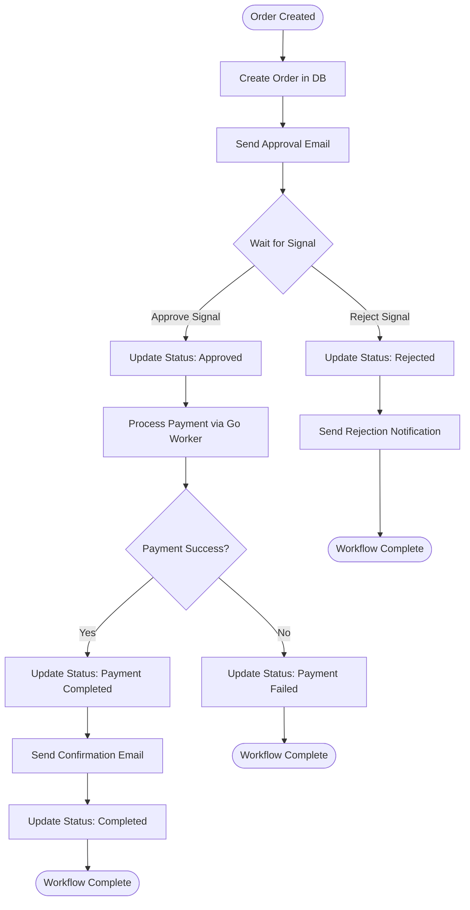

# Temporal Plugin for CakePHP: Building Reliable Workflows with Approval Order Flow

Traditional queue systems are excellent at handling independent jobs. You push a job, a worker processes it, and it completes. But what happens when you need workflows that span hours or days? What happens when workflows need to pause and wait for human approval? What happens when you need to coordinate activities across multiple languages and services?

That's where Temporal comes in. Temporal is a durable execution system that provides guarantees about workflow execution, automatic retries, and the ability to pause workflows indefinitely while waiting for external events. The [`crustum/temporal`](https://github.com/crustum/temporal) plugin for CakePHP brings these capabilities to your CakePHP applications with an elegant, framework-native API.

This article explores how to build a real-world approval workflow using the Temporal plugin. We'll implement an order approval system where orders require manager approval before payment processing, and we'll demonstrate how workflows can pause indefinitely, receive signals from web controllers, and coordinate activities across PHP and Go workers.

## Understanding Temporal's Core Concepts

Before diving into implementation, let's understand Temporal's fundamental building blocks: workflows, activities, signals, and queries.

### Workflows: Durable Function Execution

A workflow in Temporal is a function that can run for seconds, minutes, hours, or even days. Temporal guarantees that workflow code will execute to completion, even if the worker crashes or restarts. Workflows are deterministic—they produce the same result when given the same inputs, making them replay-safe.

Workflows can call activities (which can fail and be retried), wait for signals from external systems, and be queried for their current state. The workflow code itself never performs I/O operations like database queries or HTTP requests—those happen in activities.

### Activities: Your Actual Work

Activities are regular functions that perform your actual business logic: database operations, API calls, file processing, etc. Activities can fail, and Temporal automatically retries them according to your retry policy. Activities are non-deterministic and can perform any I/O operation.

The key distinction: workflows orchestrate the business process, while activities perform the actual work.

### Signals: External Communication

Signals allow external systems to communicate with running workflows. When a workflow is paused waiting for a condition, you can send it a signal to continue execution. In our approval workflow, the manager's approval decision arrives as a signal.

### Queries: Reading Workflow State

Queries allow you to read the current state of a running workflow without affecting its execution. This is perfect for status pages where users need to see the current progress of their order.

## The Approval Order Flow: A Real-World Scenario

Our approval workflow models a common business process: orders that require manager approval before payment processing. Here's the complete flow:

1. Customer creates an order
2. System creates order in database and generates approval token
3. System sends approval request email to manager
4. **Workflow pauses, waiting for manager's decision**
5. Manager approves or rejects via web interface
6. If approved: process payment, send confirmation
7. If rejected: send rejection notification, update order status
8. Workflow completes

This workflow can take hours or days if the manager doesn't respond immediately. Traditional queue systems struggle with this—you'd need to poll the database repeatedly, manage timeouts, and handle worker restarts. Temporal handles all of this automatically.

## Plugin Architecture: Builders and Interfaces

The Temporal plugin uses a builder pattern that feels natural in CakePHP applications. Instead of manually constructing workflow and activity stubs, you use fluent builders that read configuration from CakePHP's Configure system.

### Creating Workflows

To start a workflow from a controller, you use the `WorkflowBuilder`:

```php
use Crustum\Temporal\Temporal;
use App\Workflows\OrderApprovalWorkflowInterface;

$workflow = Temporal::newWorkflow()
    ->withWorkflowId($workflowId)
    ->withWorkflowRunTimeout(new \DateInterval('PT3600S'))
    ->build(OrderApprovalWorkflowInterface::class);

$client = Temporal::getClient();
$run = $client->start($workflow, $orderData);
```

The builder reads default configuration from `Configure::read('Temporal.queue')` and `Configure::read('Temporal.retry.workflow')`, but you can override any option inline. This keeps your code clean while providing flexibility when needed.

### Creating Activities

Inside workflows, you create activity stubs using the `ActivityBuilder`:

```php
use Crustum\Temporal\Temporal;
use App\Activities\OrderActivityInterface;
use Temporal\Common\RetryOptions;

$orderActivity = Temporal::newActivity()
    ->withStartToCloseTimeout(new \DateInterval('PT10S'))
    ->withRetryOptions(
        (new RetryOptions())
            ->withMaximumAttempts(3)
    )
    ->build(OrderActivityInterface::class);

$result = yield $orderActivity->createOrder($orderData);
```

The builder automatically discovers activity interfaces using attributes and creates properly configured stubs. This eliminates boilerplate while ensuring type safety through interfaces.

## Workflow Implementation: Orchestrating the Process

The workflow is the heart of our approval system. It orchestrates all the steps, manages state, and waits for external signals. Let's examine the complete implementation:

```php
// src/Workflows/OrderApprovalWorkflow.php
    public function processOrder(array $orderData)
    {
        $orderActivity = Temporal::newActivity()
            ->withStartToCloseTimeout(new \DateInterval('PT10S'))
            ->withRetryOptions(
                (new RetryOptions())
                    ->withMaximumAttempts(3)
            )
            ->build(OrderActivityInterface::class);

        $goPaymentActivity = Temporal::newActivity()
            ->withTaskQueue('go-payment-queue')
            ->withStartToCloseTimeout(new \DateInterval('PT30S'))
            ->withRetryOptions(
                (new RetryOptions())
                    ->withMaximumAttempts(3)
            )
            ->buildUntyped();

        $notificationActivity = Temporal::newActivity()
            ->withStartToCloseTimeout(new \DateInterval('PT10S'))
            ->build(NotificationActivityInterface::class);

        $this->currentStatus = 'creating_order';
        $orderResult = yield $orderActivity->createOrder($orderData);
        $orderId = $orderResult['order_id'];
        $this->currentOrderId = $orderId;
        $approvalToken = $orderResult['approval_token'];

        $execution = Workflow::getInfo()->execution;
        yield $orderActivity->updateOrderStatus($orderId, 'pending_approval', [
            'workflow_id' => $execution->getID(),
            'run_id' => $execution->getRunID(),
        ]);

        $this->currentStatus = 'awaiting_approval';

        yield $notificationActivity->sendApprovalRequest(
            $orderId,
            $orderData['manager_email'],
            $orderResult['approval_url']
        );

        yield Workflow::await(
            fn() => $this->approved || $this->rejectionData !== null
        );

        if ($this->rejectionData !== null) {
            $this->currentStatus = 'rejecting';
            yield $orderActivity->updateOrderStatus(
                $orderId,
                'rejected',
                ['reason' => $this->rejectionData['reason'] ?? 'No reason provided']
            );

            yield $notificationActivity->sendRejectionNotification(
                $orderId,
                $orderData['customer_email'],
                $this->rejectionData['reason'] ?? 'No reason provided'
            );

            $this->currentStatus = 'rejected';
            return [
                'status' => 'rejected',
                'order_id' => $orderId,
                'reason' => $this->rejectionData['reason'] ?? null,
            ];
        }

        $this->currentStatus = 'processing_payment';
        yield $orderActivity->updateOrderStatus(
            $orderId,
            'approved',
            ['user_id' => $this->approvalData['user_id'] ?? null]
        );

        try {
            $paymentResult = yield $goPaymentActivity->execute(
                'payment.ProcessPayment',
                [(string)$orderId, (float)$orderData['total_amount']]
            );

            if (is_object($paymentResult)) {
                $paymentResult = json_decode(json_encode($paymentResult), true);
            }
        } catch (\Throwable $e) {
            $this->currentStatus = 'payment_failed';
            yield $orderActivity->updateOrderStatus($orderId, 'payment_failed');

            return [
                'status' => 'payment_failed',
                'order_id' => $orderId,
                'error' => $e->getMessage(),
            ];
        }

        yield $orderActivity->updateOrderStatus($orderId, 'payment_completed', [
            'payment_id' => $paymentResult['payment_id'] ?? null,
            'payment_status' => 'completed'
        ]);

        $this->currentStatus = 'sending_confirmation';
        yield $notificationActivity->sendOrderConfirmation(
            $orderId,
            $orderData['customer_email']
        );

        $this->currentStatus = 'completing';
        yield $orderActivity->updateOrderStatus($orderId, 'completed');
        $this->currentStatus = 'completed';

        return [
            'status' => 'completed',
            'order_id' => $orderId,
            'payment_id' => $paymentResult['payment_id'] ?? null,
            'message' => 'Order processed successfully',
        ];
    }

    public function approve(array $data): void
    {
        $this->approved = true;
        $this->approvalData = $data;
    }

    public function reject(array $data): void
    {
        $this->rejectionData = $data;
    }
```

Several important patterns emerge from this implementation:

### State Management

The workflow maintains state in private properties: `$approved`, `$rejectionData`, `$approvalData`, `$currentOrderId`, and `$currentStatus`. This state persists across workflow executions. If the worker crashes while waiting for approval, Temporal will restore this state when the workflow resumes.

### The Critical Pause: Workflow::await()

The workflow pauses indefinitely at this line:

```php
yield Workflow::await(
    fn() => $this->approved || $this->rejectionData !== null
);
```

This is Temporal's superpower. The workflow stops executing and waits for the condition to become true. It doesn't consume worker resources, doesn't require polling, and can wait for days or weeks. When a signal arrives that changes the workflow state, Temporal automatically resumes execution and checks the condition again.

### Signal Handlers

The `approve()` and `reject()` methods are signal handlers marked with the `#[SignalMethod]` attribute:

```php
// src/Workflows/OrderApprovalWorkflow.php
    public function approve(array $data): void
    {
        $this->approved = true;
        $this->approvalData = $data;
    }

    public function reject(array $data): void
    {
        $this->rejectionData = $data;
    }
```

When a controller sends a signal to the workflow, Temporal calls these methods synchronously within the workflow context. They update the workflow's state, which causes the `Workflow::await()` condition to evaluate to true, resuming the workflow.

### Query Method

The workflow exposes a query method for reading its current state:

```php
// src/Workflows/OrderApprovalWorkflow.php
    #[QueryMethod(name: "getStatus")]
    public function getStatus(): array
    {
        return [
            'status' => $this->currentStatus,
            'approved' => $this->approved,
            'rejected' => $this->rejectionData !== null,
            'order_id' => $this->currentOrderId,
        ];
    }
```

Controllers can call this method to display the current workflow status without affecting workflow execution. This is perfect for status pages that refresh periodically.

### Cross-Language Activity Execution

Notice how the workflow calls a Go activity:

```php
$goPaymentActivity = Temporal::newActivity()
    ->withTaskQueue('go-payment-queue')
    ->withStartToCloseTimeout(new \DateInterval('PT30S'))
    ->withRetryOptions(
        (new RetryOptions())
            ->withMaximumAttempts(3)
    )
    ->buildUntyped();

$paymentResult = yield $goPaymentActivity->execute(
    'payment.ProcessPayment',
    [(string)$orderId, (float)$orderData['total_amount']]
);
```

The `buildUntyped()` method creates an untyped activity stub that can call activities by name rather than through a PHP interface. This allows the workflow to call activities implemented in other languages. Temporal routes the activity to the appropriate worker based on the task queue name.

## Activity Implementation: Performing the Work

Activities implement the actual business logic. They're regular PHP classes that implement activity interfaces:

```php
// src/Activities/OrderActivity.php
<?php
declare(strict_types=1);

namespace App\Activities;

use App\Model\Table\OrdersTable;
use Cake\Datasource\FactoryLocator;
use Cake\Log\Log;

class OrderActivity implements OrderActivityInterface
{
    public function __construct(
        private OrdersTable $ordersTable
    ) {
    }

    public function createOrder(array $orderData): array
    {
        Log::info('Creating order', ['data' => $orderData]);

        $ordersTable = $this->ordersTable;
        $order = $ordersTable->newEntity([
            'user_id' => $orderData['user_id'],
            'total_amount' => $orderData['total_amount'],
            'status' => 'pending_approval',
            'workflow_id' => $orderData['workflow_id'] ?? null,
            'approval_token' => bin2hex(random_bytes(16)),
            'requires_approval' => true,
            'created' => new \DateTime(),
        ]);

        if (!$ordersTable->save($order)) {
            throw new \RuntimeException('Failed to create order: ' . json_encode($order->getErrors()));
        }

        return [
            'order_id' => (string)$order->id,
            'approval_token' => $order->approval_token,
            'approval_url' => '/api/approve/' . $order->approval_token,
        ];
    }

    public function updateOrderStatus(string $orderId, string $status, ?array $data = null): void
    {
        $ordersTable = $this->ordersTable;
        $order = $ordersTable->get($orderId);

        $updateData = ['status' => $status, 'modified' => new \DateTime()];

        if (isset($data['workflow_id'])) {
            $updateData['workflow_id'] = $data['workflow_id'];
        }
        if (isset($data['run_id'])) {
            $updateData['run_id'] = $data['run_id'];
        }
        if (isset($data['payment_id'])) {
            $updateData['payment_id'] = $data['payment_id'];
        }
        if (isset($data['payment_status'])) {
            $updateData['payment_status'] = $data['payment_status'];
        }
        if ($status === 'approved' && $data) {
            $updateData['approved_by'] = $data['user_id'] ?? null;
            $updateData['approved_at'] = new \DateTime();
        } elseif ($status === 'rejected' && $data) {
            $updateData['rejection_reason'] = $data['reason'] ?? null;
        }

        $order = $ordersTable->patchEntity($order, $updateData);
        $ordersTable->save($order);

        Log::info("Order {$orderId} status updated to {$status}", $data ?? []);
    }

    public function awaitApproval(string $workflowId, string $orderId): bool
    {
        $ordersTable = $this->ordersTable;
        $order = $ordersTable->get($orderId);

        if ($order->status === 'approved') {
            return true;
        }

        if ($order->status === 'rejected') {
            return false;
        }

        return false;
    }
}
```

Activities are regular PHP classes that can use dependency injection, access the database, make HTTP requests, and perform any I/O operations. The plugin's activity discovery system automatically finds classes that implement activity interfaces and registers them with the worker.

The interface defines the contract:

```php
// src/Activities/OrderActivityInterface.php
<?php
declare(strict_types=1);

namespace App\Activities;

use Temporal\Activity\ActivityInterface;
use Temporal\Activity\ActivityMethod;

#[ActivityInterface(prefix: "order.")]
interface OrderActivityInterface
{
    #[ActivityMethod(name: "createOrder")]
    public function createOrder(array $orderData): array;

    #[ActivityMethod(name: "updateOrderStatus")]
    public function updateOrderStatus(string $orderId, string $status, ?array $data = null): void;

    #[ActivityMethod(name: "awaitApproval")]
    public function awaitApproval(string $workflowId, string $orderId): bool;
}
```

The `#[ActivityInterface]` attribute allows you to specify a prefix for activity names, and `#[ActivityMethod]` allows custom naming. This provides flexibility in how activities are named in Temporal's task queue.

## Cross-Language Integration: Go Worker

One of Temporal's strengths is its polyglot nature. Workflows written in PHP can call activities implemented in Go, Java, TypeScript, Python, or any supported language. Our approval workflow demonstrates this by calling a payment processing activity written in Go.

The Go activity is straightforward:

```go
// go-worker/activities.go
package main

import (
	"context"
	"fmt"
	"time"

	"go.temporal.io/sdk/activity"
)

// ProcessPaymentActivity - Simple payment processing in Go
func ProcessPaymentActivity(ctx context.Context, orderID string, amount float64) (map[string]interface{}, error) {
	logger := activity.GetLogger(ctx)
	logger.Info("Processing payment in Go", "orderID", orderID, "amount", amount)

	// Simulate payment processing
	time.Sleep(2 * time.Second)

	// 90% success rate for demo
	if time.Now().Unix()%10 == 0 {
		return nil, fmt.Errorf("payment processing failed")
	}

	paymentID := fmt.Sprintf("pay_go_%d", time.Now().Unix())

	result := map[string]interface{}{
		"success":      true,
		"payment_id":   paymentID,
		"processed_by": "go-worker",
		"message":      "Payment processed successfully by Go",
	}

	logger.Info("Payment processed", "paymentID", paymentID)
	return result, nil
}
```

The Go worker registers this activity with a specific name that matches what the PHP workflow calls:

```go
// go-worker/main.go
	// Create worker
	w := worker.New(c, "go-payment-queue", worker.Options{})

	// Register activity with custom name to match PHP workflow
	// PHP calls it as 'payment.ProcessPayment', so we register with that name
	w.RegisterActivityWithOptions(ProcessPaymentActivity, activity.RegisterOptions{
		Name: "payment.ProcessPayment",
	})
```

When the PHP workflow calls `$goPaymentActivity->execute('payment.ProcessPayment', ...)`, Temporal routes the task to the Go worker listening on the `go-payment-queue` task queue. The Go worker executes the function and returns the result, which flows back to the PHP workflow.

This pattern enables microservices architectures where different services are implemented in different languages, all coordinated through Temporal workflows.

## Controller Integration: Starting Workflows and Sending Signals

Controllers bridge the web layer with Temporal workflows. They start workflows, send signals, and query workflow state.

### Starting a Workflow

When a customer creates an order, the controller starts the approval workflow:

```php
// src/Controller/OrdersController.php
    public function create()
    {
        $this->request->allowMethod(['post']);

        $orderData = [
            'user_id' => $this->request->getData('user_id'),
            'total_amount' => (float)$this->request->getData('total_amount'),
            'customer_email' => $this->request->getData('customer_email'),
            'manager_email' => $this->request->getData('manager_email') ?? 'manager@example.com',
            'items' => $this->request->getData('items'),
        ];

        $workflowId = 'order-' . time() . '-' . uniqid();

        $workflow = Temporal::newWorkflow()
            ->withWorkflowId($workflowId)
            ->withWorkflowRunTimeout(new \DateInterval('PT3600S'))
            ->build(OrderApprovalWorkflowInterface::class);

        $orderData['workflow_id'] = $workflowId;
        $client = Temporal::getClient();
        $run = $client->start($workflow, $orderData);

        $this->Flash->success('Order created successfully! Workflow ID: ' . $workflowId);
        return $this->redirect(['action' => 'status', $workflowId]);
    }
```

The controller generates a unique workflow ID, builds a workflow stub, and starts the workflow with `$client->start()`. This call returns immediately—the workflow runs asynchronously in the background. The controller redirects to a status page where the user can monitor progress.

### Querying Workflow State

The status page queries the workflow's current state:

```php
// src/Controller/OrdersController.php
    public function status(string $workflowId)
    {
        $client = Temporal::getClient();

        try {
            $workflowQuery = Temporal::newWorkflow()
                ->withWorkflowId($workflowId)
                ->build(OrderApprovalWorkflowInterface::class);

            $workflowState = null;
            try {
                $workflowState = $workflowQuery->getStatus();
            } catch (\Exception $e) {
            }

            $query = "WorkflowId = '{$workflowId}'";
            $executionInfo = null;
            foreach ($client->listWorkflowExecutions($query, null, 1) as $info) {
                $executionInfo = $info;
                break;
            }

            $status = 'UNKNOWN';
            $startTime = null;
            $closeTime = null;

            if ($executionInfo) {
                $status = $executionInfo->status->name;
                $startTime = $executionInfo->startTime;
                $closeTime = $executionInfo->closeTime;
            }

            $order = $this->Orders->find()
                ->where(['workflow_id' => $workflowId])
                ->first();

            $this->set(compact('workflowId', 'status', 'workflowState', 'order', 'startTime', 'closeTime'));
        } catch (\Exception $e) {
            $this->Flash->error('Error loading workflow status: ' . $e->getMessage());
            $this->set('error', $e->getMessage());
        }
    }
```

The controller builds a workflow stub for the existing workflow (using `withWorkflowId()` without `start()`), then calls the query method `getStatus()`. This returns the workflow's current state without affecting its execution. The controller also fetches execution metadata from Temporal to show when the workflow started and completed.

### Sending Signals

When a manager approves or rejects an order, the controller sends a signal to the waiting workflow:

```php
// src/Controller/ApprovalController.php
    public function approve(string $token)
    {
        $this->request->allowMethod(['post']);

        $ordersTable = $this->getOrdersTable();
        $order = $ordersTable->find()
            ->where(['approval_token' => $token, 'status' => 'pending_approval'])
            ->first();

        if (!$order) {
            $this->Flash->error('Order not found or already processed');
            return $this->redirect(['controller' => 'Pages', 'action' => 'display', 'home']);
        }

        $client = Temporal::getClient();

        try {
            $workflow = $client->newRunningWorkflowStub(
                OrderApprovalWorkflowInterface::class,
                $order->workflow_id
            );

            $workflow->approve([
                'user_id' => $this->request->getData('user_id') ?? 0,
                'approved_at' => time(),
                'notes' => $this->request->getData('notes'),
            ]);

            $order = $ordersTable->patchEntity($order, [
                'status' => 'approved',
                'approved_by' => $this->request->getData('user_id') ?? 0,
                'approved_at' => new \DateTime(),
            ]);
            $ordersTable->save($order);

            $this->Flash->success('Order approved successfully!');
            return $this->redirect(['controller' => 'Orders', 'action' => 'status', $order->workflow_id]);
        } catch (\Exception $e) {
            $this->Flash->error('Failed to approve order: ' . $e->getMessage());
            return $this->redirect(['action' => 'view', $token]);
        }
    }
```

The controller uses `$client->newRunningWorkflowStub()` to create a stub for the already-running workflow. This is different from starting a new workflow—it creates a proxy that can communicate with the existing workflow instance. The controller then calls `$workflow->approve()`, which sends a signal to Temporal. Temporal delivers the signal to the waiting workflow, which resumes execution.

The signal handler in the workflow runs synchronously and updates the workflow state:

```php
public function approve(array $data): void
{
    $this->approved = true;
    $this->approvalData = $data;
}
```

Once the signal handler completes, the `Workflow::await()` condition evaluates to true (since `$this->approved` is now true), and the workflow continues processing.

## Complete Flow: From Order Creation to Completion

Let's trace through the complete execution flow to understand how all the pieces fit together:

### Step 1: Customer Creates Order

The customer submits an order form. The `OrdersController::create()` action:
1. Validates the request data
2. Generates a unique workflow ID: `order-1234567890-abc123`
3. Builds a workflow stub using `Temporal::newWorkflow()`
4. Starts the workflow with `$client->start($workflow, $orderData)`
5. Returns immediately, redirecting to the status page

### Step 2: Workflow Starts Execution

Temporal routes the workflow to a PHP worker. The workflow begins executing:

1. Creates activity stubs for `OrderActivity`, `NotificationActivity`, and the Go payment activity
2. Calls `createOrder()` activity, which:
   - Creates order record in database
   - Generates approval token
   - Returns order ID and approval URL
3. Updates order status to `pending_approval`
4. Sends approval request email to manager
5. Reaches `Workflow::await()` and pauses

At this point, the workflow is suspended. It's not consuming worker resources, and it can remain paused indefinitely. If the worker crashes or restarts, Temporal will restore the workflow state and resume execution from the same point when a signal arrives.

### Step 3: Manager Receives Email and Clicks Approval Link

The manager receives an email with a link like `/approval/view/abc123def456`. The `ApprovalController::view()` action displays the order details and an approval form.

### Step 4: Manager Approves Order

The manager submits the approval form. The `ApprovalController::approve()` action:

1. Validates the approval token
2. Creates a running workflow stub using `newRunningWorkflowStub()`
3. Calls `$workflow->approve()` with approval data
4. Updates the database order record
5. Returns success message

When `$workflow->approve()` is called, Temporal:
1. Stores the signal in its database
2. Routes the signal to the workflow instance
3. Calls the workflow's `approve()` signal handler
4. The signal handler sets `$this->approved = true`
5. The `Workflow::await()` condition becomes true
6. The workflow resumes execution

### Step 5: Workflow Continues Processing

The workflow resumes after the `await()` call. Since `$this->approved` is true, it proceeds with the approval path:

1. Updates order status to `approved`
2. Calls the Go payment activity via `$goPaymentActivity->execute()`
3. Temporal routes the activity to the Go worker on `go-payment-queue`
4. Go worker processes the payment and returns result
5. Updates order status to `payment_completed`
6. Sends confirmation email to customer
7. Updates order status to `completed`
8. Returns final result

### Step 6: Customer Views Status

The customer refreshes the status page. The controller queries the workflow's `getStatus()` method, which returns the current state: `status => 'completed'`, `order_id => '123'`, etc. The view displays the completed order with payment confirmation.

### Visualizing the Workflow Flow

The flowchart below provides a visual representation of the complete approval order workflow, showing all decision points and paths through the system:



The diagram illustrates three primary execution paths: the happy path (approval → payment success → completion), the rejection path (manager rejects → notification → completion), and the failure path (payment fails → error handling → completion). Notice how the workflow can pause indefinitely at the "Wait for Signal" decision point, representing the `Workflow::await()` call that suspends execution until the manager responds. This visualization makes it clear how Temporal's durable execution model handles long-running processes with human-in-the-loop decision points.

## Error Handling and Retries

Temporal's automatic retry system handles transient failures gracefully. When an activity fails, Temporal automatically retries it according to the retry policy:

```php
$orderActivity = Temporal::newActivity()
    ->withRetryOptions(
        (new RetryOptions())
            ->withMaximumAttempts(3)
    )
    ->build(OrderActivityInterface::class);
```

If the `createOrder()` activity fails due to a temporary database connection issue, Temporal will retry it up to 3 times with exponential backoff. Only if all retries exhaust does the workflow fail.

For the payment activity, we also configure retries:

```php
$goPaymentActivity = Temporal::newActivity()
    ->withTaskQueue('go-payment-queue')
    ->withStartToCloseTimeout(new \DateInterval('PT30S'))
    ->withRetryOptions(
        (new RetryOptions())
            ->withMaximumAttempts(3)
    )
    ->buildUntyped();
```

If the Go payment service is temporarily unavailable, Temporal retries the activity. The workflow doesn't need to implement retry logic—Temporal handles it automatically.

The workflow itself can catch exceptions from activities and handle them:

```php
try {
    $paymentResult = yield $goPaymentActivity->execute(
        'payment.ProcessPayment',
        [(string)$orderId, (float)$orderData['total_amount']]
    );
} catch (\Throwable $e) {
    $this->currentStatus = 'payment_failed';
    yield $orderActivity->updateOrderStatus($orderId, 'payment_failed');
    return [
        'status' => 'payment_failed',
        'order_id' => $orderId,
        'error' => $e->getMessage(),
    ];
}
```

After retries are exhausted, if the payment still fails, the workflow catches the exception, updates the order status, and returns a failure result. The workflow completes in a failed state, but it completes—it doesn't leave the system in an inconsistent state.

## Benefits of the Temporal Approach

Compared to traditional queue-based approaches, Temporal provides several key benefits:

### Durability and Guarantees

Temporal guarantees that workflows will execute to completion. If a worker crashes, Temporal automatically resumes the workflow from the last checkpoint. You don't need to worry about lost jobs or inconsistent state.

### Long-Running Processes

Traditional queues struggle with long-running processes. You'd need to implement polling, timeouts, and state management. Temporal workflows can run for days or weeks, pausing indefinitely while waiting for external events.

### Human-in-the-Loop Workflows

Workflows can pause and wait for human input. The approval workflow demonstrates this—it waits indefinitely for the manager's decision. When the signal arrives, execution resumes automatically.

### Polyglot Architecture

Workflows can coordinate activities across multiple languages and services. The PHP workflow calls a Go activity seamlessly. This enables microservices architectures where each service uses the best language for its domain.

### Automatic Retries

Temporal automatically retries failed activities according to configurable policies. You don't need to implement retry logic in your workflow code—Temporal handles it transparently.

### Observable and Queryable

Workflows expose query methods that allow you to read their current state without affecting execution. This enables real-time status pages and monitoring dashboards.

## Conclusion

The Temporal plugin for CakePHP brings the power of durable execution to your applications. Workflows can orchestrate complex business processes that span hours or days, coordinate activities across multiple languages, and pause indefinitely while waiting for human input.

The approval order flow demonstrates these capabilities in a real-world scenario. The workflow creates an order, sends an approval request, waits for the manager's decision, processes payment using a Go worker, and sends confirmation—all with automatic retries, durability guarantees, and observable state.

Whether you're building approval workflows, processing long-running tasks, coordinating microservices, or implementing complex business processes, Temporal provides the foundation for reliable, maintainable workflow orchestration. The plugin's builder pattern and framework integration make it feel natural in CakePHP applications while providing the full power of Temporal's execution guarantees.

The next time you find yourself implementing polling loops, timeout management, or retry logic for long-running processes, consider whether a Temporal workflow would provide a cleaner, more reliable solution. The workflow approach transforms complex orchestration code into declarative business logic that's easier to understand, test, and maintain.
